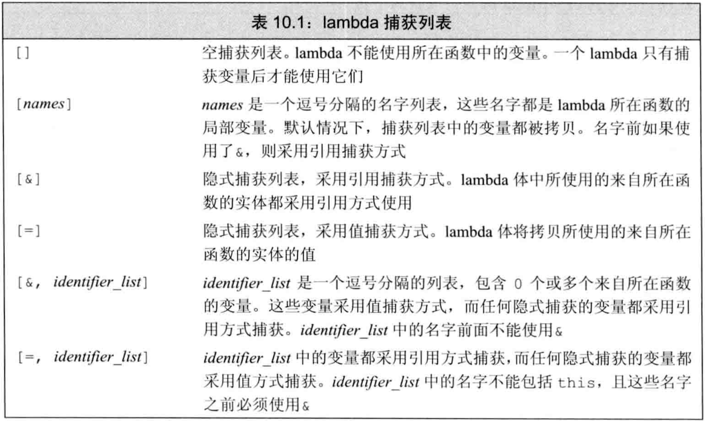
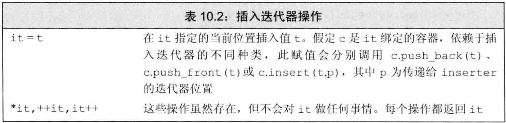
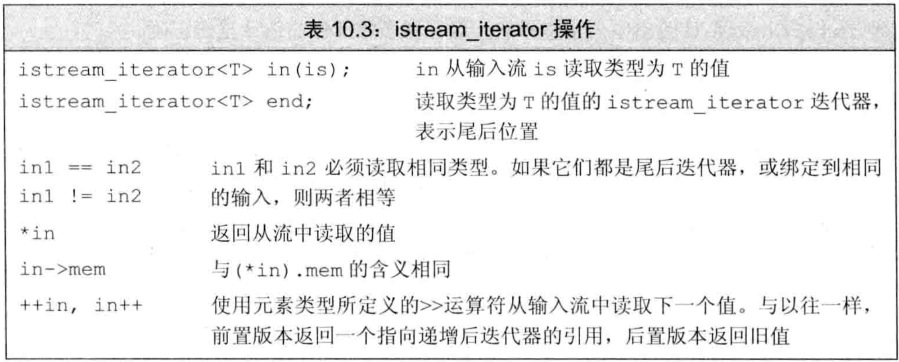
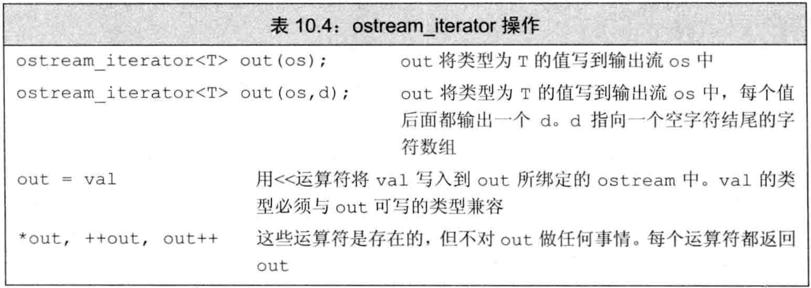
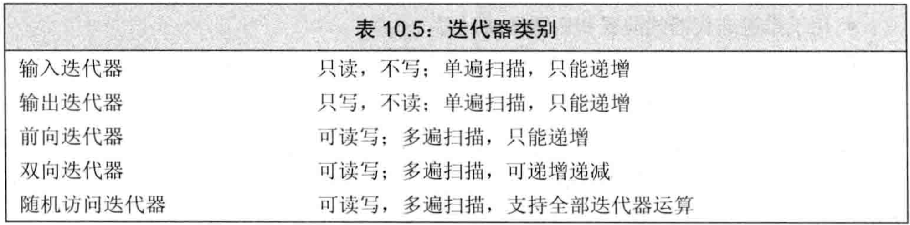
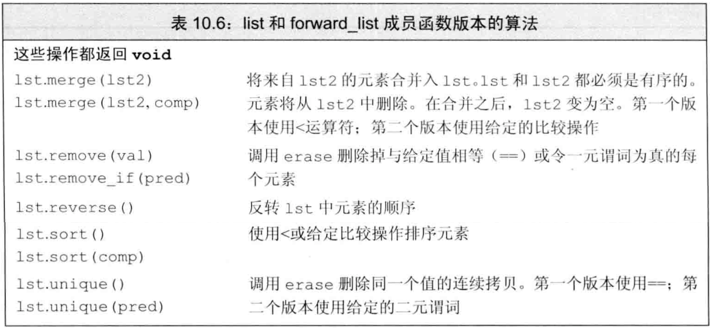
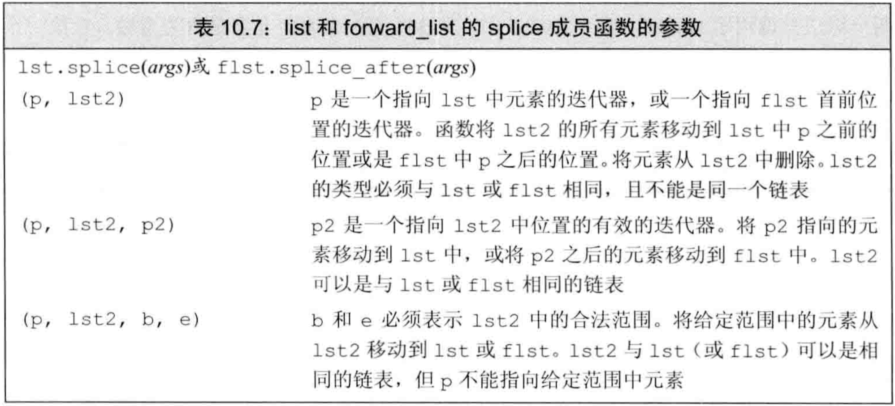

- 标准库未给容器添加大量功能，而是提供一组**独立于**容器的泛型算法
  - `算法`：它们实现了一些经典算法的公共接口
  - `泛型`：它们可用于不同类型的容器和不同类型的元素
- 利用这些算法可实现容器基本操作很难做到的事，例如查找/替换/删除特定值、重排顺序等


## 概述

- 大多数算法定义在`algorithm`头文件中，另外一组数值算法定义在`numeric`头文件中
- **标准库算法不直接操作容器，而是遍历迭代器范围**
- 指针就像内置数组上的迭代器，故泛型算法也可操作内置数组和指针（begin和end函数）
- 算法**只依赖迭代器**来访问元素并在范围中推进，不依赖于容器操作。但迭代器依赖元素类型上定义的操作，如`==`、`<`等（大多数算法提供了一种方法，允许我们使用自定义的操作来代替默认的运算符。谓词）
- 算法不会改变容器大小。它可能改变元素值或移动元素，但不会添加或删除（除非是insertor）。
- 标准库定义了`插入迭代器`，给它们赋值时会在容器上插入。算法操作这样的迭代器时可完成插入元素的效果。
- 一些算法提供了接口，允许使用自定义的`谓词`来代替默认算符


**find算法：**

- 作用：将范围中每一个元素与给定值比较，返回第一个等于给定值的元素的**迭代器**，如果没有匹配则返回该范围的尾后迭代器（即一般是第二个参数）。
- 用法：有3个参数，前2个是输入范围，第3个是给定值。
- 实现：调用给定值类型的`==`算符来比较。

**count算法：**

- 作用：将范围中每一个元素与给定值比较，返回给定值在范围中出现的**次数**。
- 用法：有3个参数，前2个是输入范围，第3个是给定值。
- 实现：调用给定值类型的`==`算符来比较。


## 初识泛型算法

- 附录A中列出所有算法
- `输入范围`：**大多标准库算法都对一个范围内的元素操作**，这个范围称为输入范围。接受输入范围的算法总是用前两个参数来表示输入范围。（即范围内的第一个元素和尾后元素的迭代器）
- 多数算法遍历输入范围的方式相似，但使用元素的方法不同（是否读，是否写，是否重排等）。


### 只读算法

- `只读算法`只读取输入范围的元素，不改变它们。如上一节的find和count
- 使用只读算法，最好用cbegin/cend
- accumulate算法（定义于numeric）：
  - 作用：对范围中元素求和，再加上给定值，返回求值结果。
  
  - 用法：有3个参数，前2个是输入范围，第3个是给定的和的初始值。
  
    第三个参数的类型决定了函数中使用哪个加法运算符以及返回值的类型
  
  - 实现：调用给定值类型的`+`算符来求和。
  
  - 序列中的元素的类型必须与第三个参数匹配，或者能够转换为第三个参数的类型。
- 例子：算法严格使用给定值的操作符

```cpp
vector<string> v={"hello","world"};
string sum=accumulate(v.cbegin(),v.cend(),"");          //错，const char *类型未定义+算符，直接将空串当作一个字符串字面值传递给第三个参数是不可以的。它的类型是const char *
string sum=accumulate(v.cbegin(),v.cend(),string(""));  //对，string上定义了+算符
```

- equal算法：
  - 作用：确定两序列的值是否相同。所有元素都相等时返回true，否则false
  - 用法：有3个参数，前2个是第一个序列的输入范围，第3个是第二个范围的首迭代器。
  - 实现：调用`==`算符来比较，容器类型不必一样，元素类型不必严格一致。


### 写容器元素的算法

- 可对序列中元素重新赋值，要求原序列大小不小于要写入的元素数目。算法不执行容器操作，故不可改变序列大小

- fill算法：

  - 作用：用给定值填满输入范围
  - 用法：有3个参数，前2个是输入范围，第3个是给定值。

- fill_n算法：

  - 作用：用给定值填满长为n的区间
  - 用法：有3个参数，第1个代表序列起始的迭代器，第2个是序列长度的计数值，第3个是填入的给定值。
  - fill_n假定长为n的空间总是有效的，类似指针运算。算法不会改变容器的大小。

  

某些算法接受单一迭代器来指定第二个序列，这些算法都假定第二个序列至少和第一个序列一样长

操作两序列的算法不要求两序列的容器相同，而且两个序列中元素的类型也不要求严格匹配，但要求元素可操作

- 操作两序列的算法分为两种：
  - 接受3个迭代器，前两个表示第一个序列的范围，第三个表示第二个序列的起始。总是假定第二个序列至少和第一个序列一样长
  - 接受4个迭代器，前两个表示第一个序列的范围，后两个表示第二个序列的范围


## 插入迭代器

- `插入迭代器`：给插入迭代器赋值会向容器中插入元素，即真正改变容器的大小。通常情况，当我们通过一个迭代器向容器元素赋值时，值被赋予迭代器指向的元素。

  当通过一个插入迭代器赋值时，一个与赋值号右侧值相等的元素被添加到容器中。

- 通过给插入迭代器赋值，算法可保证容器中总有足够的空间

- `back_inserter`函数定义于`iterator`头文件中，它接受一个指向容器的引用，**返回该容器的一个插入迭代器**。通过此迭代器赋值时，赋值符会调用容器类型的`push_back`来添加元素

  **常常使用back_inserter来创建一个迭代器，作为算法的目的位置来使用。**

- 例子：算法中使用back_inserter

```cpp
vector<int> vec;                    //空vector
fill_n(vec.begin(),10,0);           //错，算法不可向空vector写值
fill_n(back_inserter(vec),10,0);    //对，在vec尾部插入10个0
```


- copy算法：
  - 作用：将输入范围的值拷贝到目标序列，**返回的**是目的位置迭代器（递增后）的值
  - 用法：有3个参数，前2个是输入范围，第3个是目标序列的起始位置
  - 覆盖目的序列中的值，而不是插入
- 很多算法提供`copy版本`，即计算新元素的值后，不放入原来的序列，而是放入一个新序列中。
- replace算法：
  - 作用：将序列中所有等于给定值的元素换为另一个值
  - 用法：有4个参数，前2个是输入范围，后2个分别是要搜索的值和新值
- replace_copy算法：
  - 作用：将序列中所有等于给定值的元素换为另一个值，放入新序列，原序列不变。
  - 用法：有5个参数，前2个是输入范围，第3个是输出序列的首迭代器，最后2个分别是要搜索的值和新值
- 例子：replace和replace_copy

```cpp
list<int> ilst={0,1,2,3,4};
vector<int> ivec;
replace(ilst.begin(),ilst.end(),0,42);                              //原址版本，将ilst中的0都替换为42
replace_copy(ilst.cbegin(),ilst.cend(),back_inserter(ivec),0,42);   //copy版本，将ilst中的0替换为42后插入ivec，ilst不变

```


## 重排容器元素的算法

- 可对容器中元素重新排列顺序
- sort算法：
  - 作用：重排输入序列的元素使其有序
  - 用法：有2个参数，是输入范围
  - 实现：调用序列元素类型的`<`算符
  - 默认从小到大（适用普通的正向迭代器）
- unique算法：
  - 作用：不真正删除元素，只是将后面的不重复值前移来覆盖前面的重复值，使不重复值在序列前部
  - unique将不重复元素向首部集中，尾部（返回迭代器之后）的元素值是未定义
  - 用法：有2个参数，是输入范围
- 真正删除元素需要使用容器操作
- 例子：消除重复单词

```cpp
//将输入vector中的string元素重排并消除重复
void elimDups(vector<string> &words){
    sort(words.begin(),words.end());                    //将元素排序，使重复项相邻
    auto end_unique=unique(words.begin(),words.end());  //将不重复元素集中到序列前端，返回不重复元素序列的尾后迭代器
    words.erase(end_unique,words.end());                //擦除不重复序列之后的元素
}
```


## 定制操作

- 对于使用元素的`==`、`<`等算符的算法，标准库允许在执行算法时用自定义操作代替默认算符，**而不需要在类型中重载。**


### 向算法传递函数

## `谓词`：是一个**可调用的表达式**，其返回值可用作条件（即true/false）。

- 按照参数的数量分为`一元谓词`和`二元谓词`

- 接受谓词的算法用该谓词代替默认的算符来操作元素，故**元素类型必须可转为谓词接受的参数类型**。

  例如，接受二元谓词的sort用该谓词代替`<`

- `stable_sort`是`稳定排序`，即维持相等元素的原有顺序


### lambda表达式

- 根据算法接受一元谓词还是二元谓词，我们传递给算法的谓词必须严格接受一个或两个参数。但是，有时我们希望进行的操作需要更多参数，超出了算法对谓词的限制。此时需要lambda表达式
- `lambda`应用的场景：函数接口已固定，但要传入额外的参数，可用lambda的捕获列表。例如谓词中要获取局部变量时。
- find_if算法：
  - 作用：对输入范围的每个元素调用给定谓词，返回第一个使谓词非0的元素的迭代器。如果不存在这样的元素则返回尾迭代器
  - 用法：有3个参数，前2个是输入范围，第3个是一元谓词
- `可调用对象`：一个对象或表达式，若能使用调用运算符`()`，就是可调用的
- 4种可调用对象：`函数`、`函数指针`、`重载了调用算符的类`、`lambda表达式`
- `lambda表达式`：是一个可调用的代码单元，可以理解为一个未命名的`内联函数`。它有捕获列表、返回类型、形参列表、函数体，但可定义在函数内部（函数不可）
- lambda表达式形式:`[capture list](parameter list) -> return type {function body}`
  - capture list是`捕获列表`，是lambda所在函数中定义的局部变量的列表，变量以逗号隔开
  - parameter list、return type、function body与函数一样
  - lambda必须用`尾置返回`
  - 可忽略形参列表和返回类型，但**必须有**捕获列表（可以为空，但不能没有）和函数体
  - 若函数体不是单一return语句，则**必须**指定返回类型（否则为void）
- 可用变量定义的形式定义lambda，用函数调用的方式使用lambda
- 例子：使用lambda

```cpp
auto f=[]{return 42;};
cout<<f()<<endl; //用调用算符使用lambda
```

- lambda忽略返回类型时使用类型推导。如果函数体是单一return语句则可推出类型，否则返回void。
- 调用lambda时用实参初始化形参的方式和函数相同，但`lambda不可有默认实参`
- lambda将局部变量包含在捕获列表中来访问它们，只有被捕获到的局部变量才可在函数体中被使用。但只有`局部非static变量`才需要捕获，`lambda可直接使用定义在当前函数之外的名字和局部static变量，且不能捕获`
- for_each算法：
  - 作用：对输入范围的每个元素调用给定的**可调用对象**
  - 用法：有3个参数，前2个是输入范围，第3个是可调用对象
- 例子：计数并按字典序打印长度>=给定值的字符串

```cpp
//将输入vector中的string元素重排并消除重复
void elimDups(vector<string> &words){
    sort(words.begin(),words.end());                    //将元素排序，使重复项相邻
    auto end_unique=unique(words.begin(),words.end());  //将不重复元素集中到序列前端，返回不重复元素序列的尾后迭代器
    words.erase(end_unique,words.end());                //擦除不重复序列之后的元素
}
//计数并按字典序打印vector<string>中长度>=给定值的string
void biggies(vector<string> &words, vector<string>::size_type sz){
    //按字典排序并消除重复
    elimDups(words);
    //对字符串长度做稳定排序，长度相同的单词维持字典序
    //用lambda做二元谓词比较两元素
    stable_sort(words.begin(),words.end(),
                [](const string &a, const string &b){return a.size()<b.size();});
    //找到第一个长度>=sz的元素
    //用lambda做一元谓词比较元素和变量
    auto wc=find_if(words.begin(),words.end(),
                    [sz](const string &a){return a.size()>=sz;});
    //计算长度>=sz的元素数目
    auto count=words.end()-wc;
    cout<<count<<" "<<(count>1)?("words"):("word")
        <<" of length "<<sz<<" or longer"
        <<endl;
    //打印长度>=sz的元素，每个元素后接一个空格
    //用lambda遍历元素
    for_each(wc,words.end(),
             [](const string &s){cout<<s<<" ";});
    cout<<endl;
}
```


### lambda捕获和返回

- `lambda实际是匿名类`：定义lambda时，编译器生成一个与其对应的未命名的类类型
- 向函数传递lambda时，同时定义了一个新类型和该类型的一个对象，传递的参数就是该对象。用auto定义一个lambda初始化的变量时，该变量也是这种对象。
- 默认情况下，从lambda生成的类都有一个数据成员对应捕获到的变量。lambda的数据成员在创建时被初始化，即`被捕获的变量用于初始化lambda匿名对象的成员`
- lambda捕获变量的方式可用`值捕获`和`引用捕获``
  - ``值捕获`存在拷贝，且值捕获的变量是在lambda创建（lambda对象构造）时被拷贝，而不是调用时拷贝，故创建lambda后修改捕获变量不影响lambda中的值。
  - 使用`引用捕获（以&开头）`时必须确保lambda执行时被捕获变量存在。例如，从函数中返回lambda时不可用引用捕获。引用捕获有时是必须的。
  - **最佳实践：**尽量减少捕获的变量，且避免捕获指针/引用
- 例子：值捕获的变量会被拷贝，引用捕获的变量不会

```cpp
void fcn1(){
    size_t v=42;
    auto f1=[v]{return v;};     //值捕获，创建lambda（构造lambda对象）
    auto f2=[&v]{return v;};    //引用捕获，创建lambda（构造lambda对象）
    v=0;                        //改变捕获变量的值
    auto j1=f1();               //j1是42，因为lambda创建时保存了捕获变量的拷贝
    auto j2=f2();               //j2是0，因为lambda创建时未拷贝捕获变量，只是建立了引用
}
```

- `隐式捕获`：可让编译器根据lambda函数体中的代码来推断要捕获哪些变量。
- 使用隐式捕获，需在捕获列表中写`&`或`=`（不能同时写），分别对应引用捕获和值捕获
- 可混合使用隐式捕获和显式捕获，只需在捕获列表中写`&`或`=`，再写显式捕获的变量，要求：
  - 捕获列表第一个元素必须是`&`或`=`，指定默认为引用/值捕获
  - 显式捕获的变量必须使用与隐式捕获不同的方式。即隐式引用捕获，则显式必须为值捕获，反之亦然
- 例子：混合使用隐式捕获和显式捕获

```cpp
void print_strings(vector<strin> &words, ostream &os=cout, char c=' '){
    //c为显式值捕获，其他变量（os）为隐式引用捕获
    for_each(words.begin(),words.end(),
             [&,c](const string &s){os<<s<<c;});
    //os为显式引用捕获，其他变量（c）为隐式值捕获，等价于上一行
    for_each(words.begin(),words.end(),
             [=,&os](const string &s){os<<s<<c;});
}
```

表10.1是lambda捕获列表可能的状态



- `可变lambda`：`普通lambda不会改变值捕获的变量的copy的值`，但可变lambda**可改变**值捕获的变量的copy的值，只需在参数列表后使用关键字`mutable`
- 例子：可变lambda

```cpp
void fcn3(){
    size_t v=42;
    auto f=[v]() mutable {return ++v;}  //mutalbe，允许改变捕获到的copy的值
    v=0;
    auto j=f();                         //j是43
}
```

- 默认情况下，若lambda函数体包含return之外的任何语句，则编译器推断它返回void，返回void的函数不能返回值，除非手动指定返回类型
- 为lambda指定返回类型时，必须使用`尾置返回`；p353页替换为if-else语句时，无法推断返回值类型，产生编译错误。
- transform算法：
  - 作用：对输入范围的每个元素调用可调用对象，将返回值依次写入目标序列
  - 用法：有4个参数，前2个是输入范围，第3个是目的位置的迭代器，第4个是可调用对象
- transform写入的目标序列和输入序列可以相同，即可以向原址写入
- transform和for_each的区别：
  - transform可进行非原址写，for_each不可（除非在可调用对象内写非原址目标）
  - transform通过可调用对象的返回值写入，for_each在可调用对象内部操作
- 例子：lambda的返回值

```cpp
vector<int> vi={0,1,2,3,4};
transform(vi.begin(),vi.end(),vi.begin(),
          [](int i)->int{if(i<0) return -i; else return i;}); //取绝对值
```


### 参数绑定(bind函数的非占位符参数相当于lambda中的值捕获，可以应用于需要多个参数的情形)

- 对于少数地方使用的简单操作用lambda，而多次调用时应该定义函数。
- 若lambda的捕获列表为空，可用函数替换它。但对于有捕获列表的lambda，很难用函数替换。因为不能在函数中定义函数，导致不能在不修改形参的前提下使用局部变量（例如标准库算法中的可调用对象，其形参必须固定）。
- 在`functional`头文件中定义了`bind`函数，可看作通用的函数适配器。它接受一个可调用对象，生成新的可调用对象来适应原对象的参数列表（即改变可调用对象的调用接口）
- 调用bind的形式为：`auto newCallable=bind(callable,arg_list);`
  - callable是可调用对象，arg_list是逗号分隔的参数列表，对应callable的参数
  - 调用newCallable时，是在用arg_list的参数调用callable
  - arg_list中的参数可包含占位符，即`_n`，其中`n`是传入newCallable的第n个参数；
- 名字`_n`都定义于`placeholders`命名空间中，该命名空间又定义于`std`命名空间。同时，placeholders命名空间定义于`functional`头文件
- 使用`using namespace namespace_name`来说明希望所有来自namespace_name的名字都可在程序中直接使用
- 例子：使用bind

```cpp
auto g=bind(f,a,b,_2,c,_1); //对g的定义，abc类似于lambda的捕获列表；用g的第二个参数，传给f的第3个参数，g的第一个参数传给f的第2个参数。
g(first,second);                   //调用g
f(a,b,second,c,first);             //等价于调用g
```

- **可用bind重排参数顺序**（可以由从大到小排列，改为由小到大排列）
- 默认下，bind的非占位符参数被`拷贝`到可调用对象中，类似lambda中的`值捕获`

- 用`ref`函数可在bind中实现和lambda中的`引用捕获`同样的效果
- `ref`函数返回一个对象，该对象中包含输入的引用，且可拷贝。若需要包含const引用，则应用`cref`函数。ref和cref也定义于`functional`头文件中
- 例子：用bind和ref捕获引用

```cpp
/* 上下文：os是局部变量，引用输出流；c是局部变量，类型为char */
//lambda实现，引用捕获输出流，值捕获字符
for_each(words.begin(),words.end(),
         [&os,c](cons string &s){os<<s<<c;});
//函数实现，要被标准库算法使用，需要用bind捕获os和c
ostream &print(ostream &os, const string &s, char c){
    return os<<s<<c;
}
//错，os不可拷贝，不能用默认方式bind
for_each(words.begin(),words.end(),
         bind(print,os,_1,' '));
//对，用ref返回的对象包含os引用且可拷贝
for_each(words.begin(),words.end(),
         bind(print,ref(os),_1,' '));
```

- 在C++11之前，标准库定义了`bind1st`和`bind2nd`来绑定第一个或第二个参数。由于局限性太强，在C++11中被deprecated


# 再探迭代器

- 除了为每个容器定义的迭代器之外，标准库在iterator头文件中定义了额外的迭代器：
  - `插入迭代器`：被绑定到一个容器，赋值时向容器中插入元素
  - `流迭代器`：绑定到输入输出流，用于遍历这个流
  - `反向迭代器`：向后而不是向前移动**，除forward_list外**的所有标准库容器都有反向迭代器
  - `移动迭代器`：不是拷贝元素，而是移动元素（p480详细介绍）


### 插入迭代器

- `插入器`是一种`迭代器适配器`，它接受一个容器，生成一个迭代器，可通过该迭代器向容器添加元素。
- 通过插入迭代器赋值时，该迭代器调用对应的容器操作来向给定位置插入元素
- 插入迭代器支持的操作见表10.2



- 有3种插入迭代器，区别在于插入的位置：
  - `back_inserter`函数：创建一个使用`push_back`的迭代器。
  - `front_inserter`函数：创建一个使用`push_front`的迭代器。
  - `inserter`函数：创建一个使用`insert`的迭代器。它接受迭代器作为第二个参数来指定位置。使用返回的迭代器时，插入的元素在指定位置**之前**
- 只有容器本身支持push_back/push_front/insert，才可用back_inserter/front_inserter/inserter
- inserter等价于两步操作：先`insert`后`++`：（通过对insert返回的迭代器解引用赋值，或通过++运算符，该操作的结果仍使迭代器指向原来的元素，都不改变迭代器的指向）

```cpp
auto it=inserter(c,iter);   //iter是it的初始位置
*it=val;
//上一行等价于下两行
it=c.insert(it,val);        //先在it前插入，之后it指向插入元素。
++it;                       //再递增it，使其与给定位置iter一致。
```

- 反复调用front_inserter插入元素的顺序与插入顺序相反，而back_inserter/inserter插入元素的顺序与插入顺序相同
- **插入迭代器的`*`和`++`算符不会对迭代器做任何事。**（如何理解）


### iostream迭代器

- iostream类型不是容器，但也可用迭代器操作：
  - `istream_iterator`：读输入流
  - `ostream_iterator`：写输出流
- 创建流迭代器时需在模板参数中指定读写类型，使用时调用该类型的`<<`、`>>`算符。流迭代器将其对应的流当作该类型的元素序列处理
- 创建istream_iterator时，可将其绑定到一个流。也可默认初始化为`尾后迭代器`。
- 对于绑定到流的迭代器，一旦关联的流遇到文件末尾或IO错误，则迭代器等于尾后迭代器
- 例子：使用istream_iterator

```cpp
istream_iterator<int> in_iter(cin), eof;    //in_iter绑定到cin，eof作为输入流的尾后迭代器
//法1：先创建vector再依次读取数据、插入
vector<int> vec;
while(in_iter!=eof)
    vec.push_back(*in_iter++);              //用迭代器从cin中读数据
//法2：直接用输入流迭代器创建vector
vector<int> vec(in_iter,eof);               //等价于上面3行
```

- 标准库只保证在第一次解引用输入流迭代器之前完成从流中读数据的操作，而不一定在绑定时立即读取。如果从两个不同对象同步地读取一个流，或是创建流迭代器还未使用就销毁，则何时读取是重要的。
- istream_iterator的操作见表10.3



- 例子：用算法操作流迭代器

```cpp
istream_iterator<int> in(cin), eof;
cout<<accumulate(in,eof,0)<<endl;   //将输入序列读为int并累加输出
```

- 创建ostream_iterator时有可选的第二个参数，必须是C风格字符串，在输出每个元素之后都输出该字符串。
- ostream_iterator创建时必须绑定到流，不允许默认初始化
- ostream_iterator的`*`和`++`算符不会对迭代器做任何事，因为输出操作自动递增。
- ostream_iterator的操作见表10.4



- 例子：使用ostream_iterator

```cpp
ostream_iterator<int> out_iter(cout," ");
//法1：显式写出解引用和递增
for (auto e:vec)
    *out_iter++=e;
//法2：流自动解引用和递增
for (auto e:vec)
    out_iter=e;
//法3：直接向流中拷贝
copy(vec.begin(),vec.end(),out_iter);
```


### 反向迭代器

- `反向迭代器`：在容器中从尾元素向首前元素移动，`++`向后移动，`--`向前移动（前是指头，后是指尾）
- 除forward_list外的容器都有反向迭代器。可通过`rbgein`、`crbegin`、`rend`、`crend`函数来得到指向首前元素和尾元素的迭代器，如图（插图有误）


- 反向迭代器的作用是让算法**透明地**向前或向后处理容器，例如向sort传递反向迭代器可反向排序而不需修改算法或算符
- 例子：用反向迭代器做反向排序

```cpp
sort(vec.begin(),vec.end());    //递增序
sort(vec.rbegin(),vec.rend());  //递减序
```

- 反向迭代器只能从同时支持`++`和`--`的迭代器来产生。故`forward_list`和`流迭代器`都无反向迭代器
- 反向迭代器的`base`成员函数(正向迭代器没有）**返回它对应的正向迭代器**。特别的，rbegin对应的（不代表等价于）正向迭代器是end，rend对应的正向迭代器是begin
- 反向迭代器比它对应的正向迭代器**左**偏一个位置，原因是左闭右开区间的特性。为了使`[rit1,rit2)`和`[rit1.base(),rit2.base())`表示的元素范围相同
- 从正向迭代器初始化反向迭代器，或是给反向迭代器赋值时，结果迭代器与原迭代器指向的元素不相同。
- 例子：使用反向迭代器

```cpp
string line="FIRST,MIDDLE,LAST";
//检测第一个','并打印
auto comma=find(line.cbegin(),line.cend(),',');     //检测第一个`,`
cout<<string(line.cbegin(),comma)<<endl;            //打印"FIRST"
//检测最后一个','并打印
auto rcomma=find(line.crbegin(),line.crend(),',');  //检测最后一个`,`，只需修改迭代器类型，不需修改算法
cout<<string(line.crbegin(),rcomma)<<endl;          //打印"TSAL"
cout<<string(rcomma.base(),line.cend())<<endl;      //打印"LAST"
```

- 上例中`[line.crbegin(),rcomma)`和`[rcomma.base(),line.cend())`表示的范围相同，只是方向相反，如图10.2 （插图有误）


## 泛型算法结构

- 算法最基本的特性是要求其迭代器可提供哪些操作（即可使用何种迭代器），这可分为5个迭代器类别，每个算法都会指明需要的迭代器至少是哪一种
- 表10.5是迭代器的5种类别



- 另一种算法的分类方式是按照读/写/重排元素来分类
- 算法共享一组形参规范和一组命名规范


### 5类迭代器

- 类似容器，迭代器也定义了一组公共操作，迭代器按照支持的操作来分类，形成一种层次。
- C++标准指明每种算法需要的迭代器的最小类别（即至少要支持的操作）。但对算法传递错误的迭代器经常不会被编译器警告
- `输入迭代器`
  - 操作：只可读不可写
  - 算符：`==`、`!=`、`++`、`*`、`->`
  - 访问：只能顺序访问，不保证迭代器的状态有效并再次访问元素。故只能单遍扫描
  - 例子：find和accumulate要求输入迭代器，isrteam_iterator是输入迭代器
- `输出迭代器`
  - 操作：只可写不可读
  - 算符：`++`、`*`
  - 访问：只能赋值一次，即只能单遍扫描
  - 例子：用作目的位置的迭代器通常是输出迭代器，如copy的第三个参数，osrteam_iterator
- `前向迭代器`
  - 操作：可多次读写元素
  - 算符：`==`、`!=`、`++`、`*`、`->`
  - 访问：可多次读写同一元素，**可保存迭代器状态**，可对序列多次扫描
  - 例子：replace要求前向迭代器，forward_list的迭代器是前向迭代器
- `双向迭代器`
  - 操作：可正反方向多次读写元素
  - 算符：`==`、`!=`、`++`、`--`、`*`、`->`
  - 访问：可多次读写元素，**可保存迭代器状态**，可对序列多次扫描
  - 例子：reverse要求双向迭代器，除forward_list外的容器迭代器都是双向迭代器
- `随机访问迭代器`
  - 操作：常量时间内随机读写任意元素
  - 算符：`==`、`!=`、`++`、`--`、`*`、`->`、`<`、`<=`、`>`、`>=`、`+`、`+=`、`-`、`-=`、`[]`
  - 访问：可多次读写元素，**可保存迭代器状态**，可对序列多次扫描
  - 例子：sort要求随机访问迭代器，array/deque/string/vector的迭代器、数组的指针都是随机访问迭代器


### 算法形参模式

- 大多数算法的形参具有下列4种形式之一：
  - `alg(beg,end,others);`
  - `alg(beg,end,dest,other);`
  - `alg(beg,end,beg2,other);`
  - `alg(beg,end,beg2,end2,other);`
- 参数：
  - beg和end表示操作的输入范围
  - dest是算法可写入目的位置的迭代器，假定写入任意多个元素都安全。因此dest经常被绑定到插入迭代器或输出流迭代器
  - 如果dest绑定到一个插入迭代器，插入迭代器会将新元素添加到容器中，因而保证空间是足够的。
  - beg2表示操作的第二个输入范围，假定从beg2开始的序列至少和beg到end的长度一样长
  - beg2和end2表示操作的第二个输入范围，对这种指定没有限制


### 算法命名规范

- 接受谓词的算法和不接受额外参数的算法**通常被重载**，不需另外命名
- `_if`版本：接受一个谓词代替给定元素值
- 例子：_if版本算法

```cpp
find(beg,end,val);      //接受元素值，查找第一个等于val的元素
find_if(beg,end,pred);  //接受谓词，查找第一个使谓词为真的元素
```

- `_copy`版本：输出到额外的目标空间，而不是原址
- 例子：`_copy`版本算法

```cpp
reverse(beg,end);           //逆序写入原址
reverse_copy(bed,end,dest); //逆序拷贝到dest
```

- 同时`_if`和`_copy`；这些版本接受一个目的位置迭代器和一个谓词
- 例子：同时`_if`和`_copy`

```cpp
//从v1中移除奇数
remove_if(v1.begin(),v1.end(),
          [](int i){return i%2;});
//将v1中移除奇数后剩下的拷贝到v2，v1不变（remove算法是删除元素，此版本是根据是否满足谓词条件来删除的）
remove_copy_if(v1.begin(),v1.end(),back_inserter(v2),
               [](int i){return i%2;});
```


## 特定容器算法

- 链表类型`list`

  和`forward_list`

  定义了成员函数形式的算法，如`sort`、`merge`、`remove`、`reverse`、`unuque`。

  - 通用sort要求随机访问，不可用于链表
  - 其他算法的通用版本可用于链表，但交换元素代价太高。链表可交换指针而不是交换元素，可提高性能。

- 对于链表类型list和forward_list，应优先使用成员函数版本的算法

- 表10.6是链表的成员函数版本的算法\



- 链表类型特有的算法有`splice`，用于拼接链表，该算法没有通用版本
- 表10.7是链表splice的形参



- 链表特有算法与通用算法的一个区别是：链表特有的算法会改变底层容器，通用算法不会