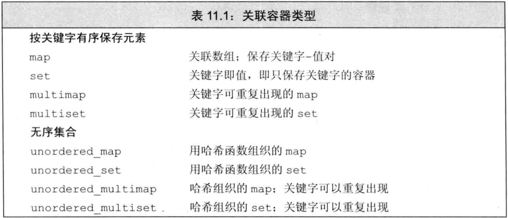
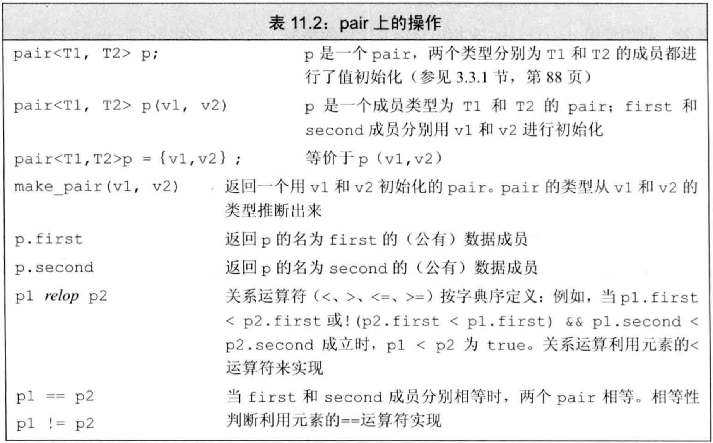
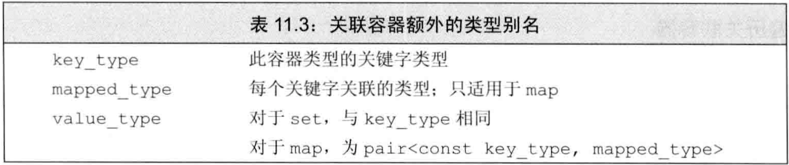
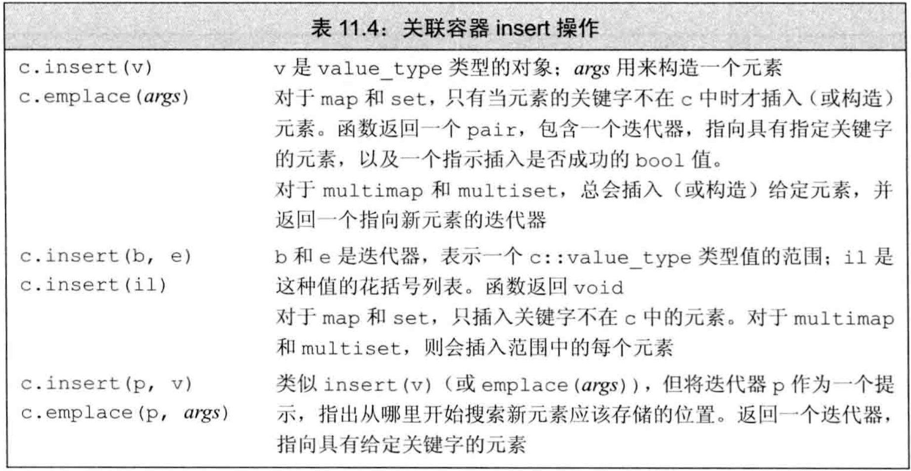
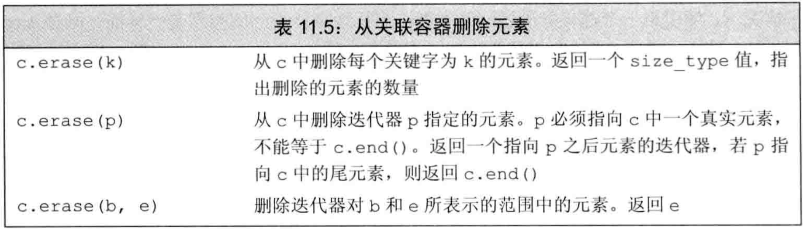
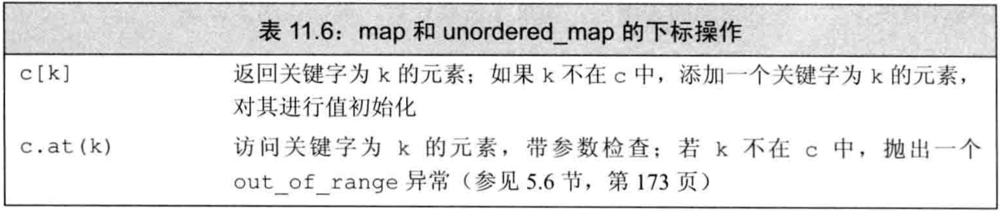
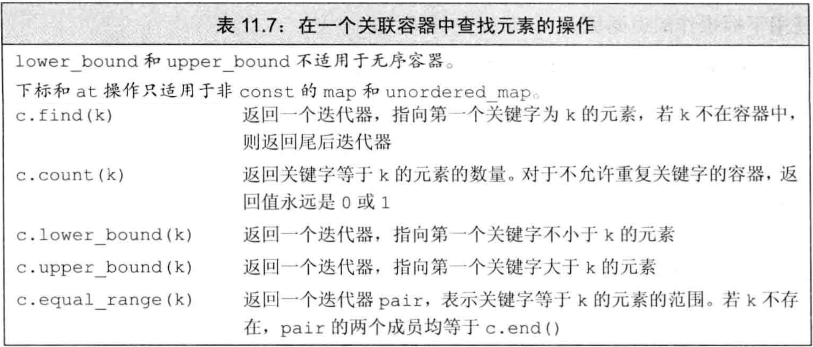
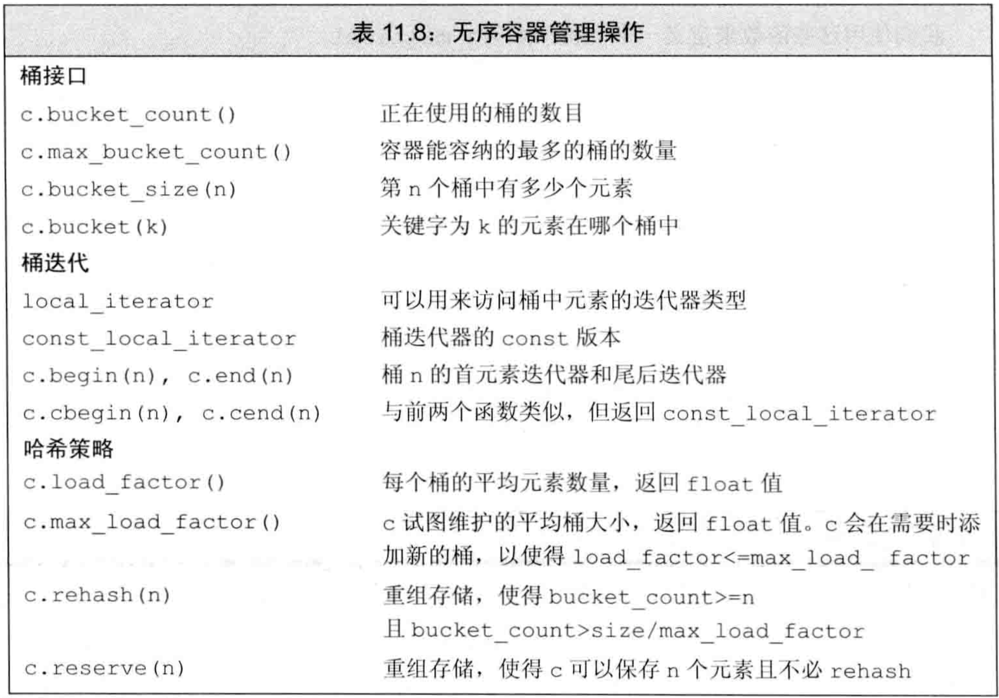

- `关联容器`的元素按照`关键字`来保存和访问，而`顺序容器`的元素是按照在容器中的`位置`来保存和访问
- 关联容器支持高效的关键字查找和访问
- 2种关联容器：
  - `map`中的元素是关键字-值对（`key-value对`），关键字作为索引，值表示与索引相关的数据
  - `set`中的元素只包含关键字
- 8个关联容器：
  - 按`类型`：或者是`map`，或者是`set`
  - 按`关键字能否重复`：或者是`multi`，或者不是
  - 按`关键字是否顺序保存`：或者是`unordered_`，或者不是（**unordered是哈希结构**）
- 4个头文件：
  - `map`和`multimap`定义于`map`头文件
  - `set`和`multiset`定义于`set`头文件
  - `unordered_map`和`unordered_multimap`定义于`unordered_map`头文件
  - `unordered_set`和`unordered_multiset`定义于`unordered_set`头文件
- 关联容器类型见表11.1




## 使用关联容器

- `map`类型常称为`关联数组`（`字典`），但其下标不必是整数，且通过关键字而不是位置来查找值
- `set`是关键字的简单集合，只想知道一个值是否存在或出现的次数时，很有用
- 例子：使用map

```cpp
map<string,size_t> word_count;          //默认初始化字典
string word;
while(cin>>word)
    ++word_count[word];                 //关键字存在则递增其值，关键字不存在则初始化其值为0后递增
for(const auto &w:word_count)           //遍历字典元素
    cout<<w.first<<" occurs "<<w.second //字典元素是pair，其first成员是key，second成员是value
        <<((w.second>1)?" times":" time")<<endl;
```

- map是模板，使用时必须在模板参数中指定key和value类型。
- 对map使用key作为下标访问其value，若key不存在则创建一个新元素，其关键字为给定key，值初始化为0(此例中初始化为0，因为值类型为size_t)

```c++
    map<string,string> a;
    a["hello"];
    a["hi"];
    cout << a.size()<<endl;		//输出为2
    cout << a["hello"] << endl;	//输出为空
```

- map的元素都是pair类型，`pair`也是模板，保存两个public**数据成员**（`first`和`second`）。map使用的pair的first成员是关键字，second是值
- 例子：使用set

```cpp
map<string,size_t> word_count;              //默认初始化字典
set<stirng> exclude={"The","But","And"};    //列表初始化集合
string word;
while(cin>>word)
    if(exclude.find(word)==exclude.end())   //在集合中查找元素，返回迭代器若为end则未找到
        ++word_count[word];
```

- set是模板，使用时必须在模板参数中指定元素类型
- 可以对关联容器（set和map都可）做`列表初始化`
- set的`find`方法返回一个迭代器，若给定关键字在set中则返回指向它的迭代器，否则返回尾后迭代器end()


## 关联容器概述

> 关联容器的迭代器都是**双向迭代器**

- 所有关联容器（有序的和无序的）都支持表9.2中的通用容器操作，但不支持顺序容器特有的操作


### 定义关联容器

- 定义map时需在模板参数中给出key和value的类型，定义set时需在模板参数中给出关键字类型

- 定义关联容器的4种方法：**表9.2中的构造函数**
  - 关联容器都有`默认构造函数`，生成空容器
  - 可将关联容器初始化为另一个`同类型容器的拷贝`
  - 可用`元素范围初始化`关联容器，只要这些元素**可转换为**关联容器所需类型
  - C++11允许对关联容器使用值初始化（`列表初始化`）
  
- 对map做列表初始化时，每个元素也是一个花括号列表，其中包含两个值

- map和set的关键字必唯一（即，对于一个给定的关键字，只能有一个元素的关键字等于它），但multimap和multiset允许多个元素有相同关键字

  也就是说，multi指的是**关键字的multi**而不是值的multi。

  - 如用来统计单词数量的map中，每个单词只能有一个元素
  - 在一个词典中，一个特定单词则可具有多个与之关联的词义

  


### 关键字类型的要求

- set的关键字就是元素，map的关键字是元素的first成员（**集合类型**中关键字类型就是元素类型；在**映射类型**中关键字类型是元素的第一部分的类型）
- 对于**有序**关联容器（map、multimap、set、multiset），关键字**必须定义**元素比较的方法，默认情况下标准库使用关键字类型的`<`算符来比较两个关键字
- 可提供自定义操作代替`<`算符，要求自定义操作在关键字类型上定义`严格弱序`（可将严格弱序看作“小于等于”）：

  - 两关键字不能同时“小于等于”对方
  - “小于等于”具有传递性
  - 若两关键字都不“小于等于”对方，则称为“等价”，“等价”具有传递性
- 若两关键字等价，则关联容器认为它们相等。用作map的key时，只能有一个value与这两个key关联，用任一个key访问都得到这个value
- Note：在实际编程中，重要的是，如果一个类型定义了“行为正常”的`<`运算符，则它可以用作关键字类型
- 若使用自定义的严格弱序函数，则定义关联容器时，必须在模板参数中紧随着元素类型给出`该函数指针类型`，在构造函数参数中给出`该函数指针（用函数名即可）`
- 例子：自定义严格弱序

```cpp
//定义严格弱序
bool compareIsbn(const Sales_data &lhs, const Sales_data &rhs){
    return lhs.isbn()<rhs.isbn();
}
using SalesSetType=multiset<Sales_data,decltype(compareIsbn) *>;    //自定义了严格弱序的multiset类型
SalesSetType bookstore(compareIsbn);                                //自定义了严格弱序的multiset对象

```


### pair类型

- `pair`类型定义于`utility`头文件中
- 一个pair保存两个**public**的数据成员，分别叫first和second
- pair是模板，创建时需在模板参数中指定两个数据成员的类型，两个类型不要求一样
- pair的默认构造函数对数据成员做`值初始化`
- pair的操作在表11.2



- 可用`make_pair`函数和auto来创建pair，其类型由传入make_pair的实参（即pair的两个成员）推出
- C++11中可用返回值做列表初始化
- 例子：返回值做列表初始化

```cpp
pair<string int> process(vector<string> &v){
    if(!v.empty())
        return {v.back(),v.back().size()};  //列表初始化返回值
    else
        return pair<string,int>();          //隐式构造返回值
}


return make_pair(v.back(),v.back().size());
```


## 关联容器操作

- 关联容器独有的类型别名见表11.3 



- 对于set，其`key_type`和`value_type`都是元素类型，即关键字类型。
- 对于map，其`key_type`是关键字类型，`mapped_type`是值类型，`value_type`是key-value对的pair类型
- 由于不能改变一个元素的关键字，**故关键字类型都是const：**
  - set的`key_type`和`value_type`都是const
  - map的`key_type`和`value_type.first`都是const
- **使用**这些类型别名时，需用作用域指明容器类型，例如`map<string,int>::key_type`
- 只有map类型（unordered_map, unordered_multimap, multimap和map）才定义了mapped_type


### 关联容器迭代器

- 迭代器解引用

  - 解引用关联容器迭代器时，得到一个类型为容器的`value_type`的引用。
  - set迭代器解引用得到的都是关键字引用，故都是常量引用。虽然同时存在iterator和const_iterator类型，**但都不可写**
  - map迭代器解引用得到的是pair的引用，first为const。其iterator可写second，const_iterator不可写
- map和set都有`begin`和`end`成员函数，可得到迭代器用于遍历元素
- 当使用迭代器遍历一个map，multimap，set或multiset时，迭代器按**关键字升序**遍历元素
- 关联容器很少使用`泛型算法`（p383）

  - 通常不对关联容器使用泛型算法。因为关键字是const，元素不可改变**也不可重排**。
  - 关联容器**只可使用只读算法**，但这些算法在关联容器中搜索时效率低下。例如用关联容器的`find成员函数`比`泛型find函数`快得多
  - 如果真要对关联容器使用泛型算法，则只能把它当源序列，或当目的位置用inserter插入


### 添加元素

- 关联容器的`insert`成员函数向容器中添加一个元素或元素范围
- 关联容器的insert/emplace操作见表11.4



- 对于无重复关键字的map和set，若插入元素的key在容器中已存在，**insert不做任何事，对容器没有任何影响**
- insert有两个版本
  - 接受一对迭代器，这些迭代器**指向的类型**可**转为**该容器的value_type
  - 接受initializer_list，即花括号列表，该列表用于构造一个value_type
- 例子：对map进行insert的4种方法

```cpp
word_count.insert({word,1});                                //花括号列表转为initializer_list
word_count.insert(make_pair(word,1));                       //make_pair函数生成pair
word_count.insert(pair<string,size_t>(word,1));             //显式构造pair
word_count.insert(map<string,size_t>::value_type(word,1));  //显式构造value_type
```

- insert/emplace的返回值依赖于容器类型和参数
- 向set/map添加**单一元素**，则insert/emplace返回一个**pair**，其first为**迭代器**，second为**bool**。
  - 若关键字不在容器中，则插入。first指向插入的元素，second为true
  - 若关键字在容器中，则插入失败。first指向给定元素，second为false
- 向multiset/multimap添加单一元素，总是插入成功（无须返回bool值），insert/emplace返回一个迭代器指向插入的元素
- 例子：对map做insert

```cpp
map<string,size_t> word_count;
string word;
while(cin>>word){
    //ret的类型是pair<map<string,size_t>::iterator,bool>
    auto ret=word_count.insert({word,1});   //尝试插入关键字和初始计数值1
    if(!ret.second)                         //如果插入失败，说明关键字已存在，只需将值递增
        ++ret.first->second;                //ret.first指向插入的元素，其second是值
}
```


### 删除元素

- 关联容器定义了3个版本的`erase`，如表11.5
- 与顺序容器一样，我们可以通过传递给erase一个迭代器或一个迭代器对来删除一个元素或者一个元素范围。



- 关联容器的特殊erase操作：可提供一个关键字，删除与其相关的所有元素，并返回删除元素的数量。对于关键字不重复的容器，erase总返回0或1。若返回0则表示想要删除的元素并不在容器中


### map的下标操作

- map和unordered_map的下标操作如表11.6：



- **只适用**于关键字不可重复的map容器：
  - map和unordered_map都有下标算符和at函数
  - multimap和unordered_multimap都不支持下标和at，因为一个关键字可能有多个值
  - 所有的set类型都不支持下标，因为没有值
- map/unordered_map下标接受一个关键字，访问与其关联的值。若关键字不在容器中，则创建元素插入容器，关联值进行`值初始化`
- 例子：map用下标插入元素时值初始化为0

```cpp
map<string,size_t> word_count;
word_count["Anna"]=1;
/*上一行的操作步骤：
 *1、容器中搜索关键字"Anna"，未找到
 *2、创建新key-value对，key是const string，value被值初始化为0
 *3、提取新插入的元素，为其赋值为1
 */
```

- 由于下标可能插入新元素，故**只可对** *非const的*map/unordered_map使用下标（at也一样）
- 通常解引用迭代器和下标返回的类型一样，但map/unordered_map不一样，它们解引用迭代器得到`value_type`，下标得到`mapped_type`
- map的下标返回`左值`
- Note：与vector与string不同，map的下标运算符返回的类型与解引用map迭代器得到的类型**不同**


### 访问元素

- 在关联容器中查找元素的方法如表11.7



- `find`判断一个关键字是否在容器中，若在则返回指向第一个key相同的元素的迭代器，否则返回end

- `count`返回容器中有多少个相同的给定关键字

- 查找时应用find而不是下标，因为下标的副作用会导致元素未找到时插入，即改变容器

- 若multiset/multimap中有重复关键字，则它们`相邻存放`，因此可找到第一个，然后递增迭代器（当遍历一个multimap或multiset时，保证可以得到序列中所有具有给定关键字的元素）

- `lower_bound`和`upper_bound`成员函数查找范围：
  - 若给定关键字在容器中，则lower_bound返回第一个匹配元素的迭代器，upper_bound返回最后一个匹配元素**之后**的迭代器
  - 若给定关键字不在容器中，则lower_bound和upper_bound都返回给定关键字的第一个`安全插入点`，即在此处insert该关键字可保持容器中关键字的顺序
  - Note：如果lower_bound和upper_bound返回相同的迭代器，则给定关键字不在容器中
- lower_bound和upper_bound都**不支持**无序容器
  
- `equal_range`成员函数相当于用同样的关键字调用lower_bound和upper_bound，它返回一个迭代器pair。
  - 若关键字在容器中，则first是指向第一个匹配元素的迭代器，second是指向最后一个匹配元素**之后**的迭代器
  - 若关键字不在容器中，则返回的两个迭代器都指向关键字可以插入的位置，即安全插入点

- 例子：关联容器查找元素

```cpp
multimap<string,string> authors;
authors.insert({"Barth, John","Sot-Weed Factor"});
authors.insert({"Barth, John","Lost in the Funhouse"});
string search_item("Barth, John");
//法1：用find查找迭代器，count计数
auto entries=authors.count(search_item);
auto iter=authors.find(search_item);
while(entries){
    cout<<iter->second<<endl;
    ++iter;
    --entries;
}
//法2：用lower_bound和upper_bound查找范围
for(auto beg=authors.lower_bound(search_item),end=authors.upper_bound(search_item);
    beg!=end;++beg)
    cout<<beg->second<<endl;
//法3：用equal_range查找范围
for(auto pos=authors.equal_range(search_item);
    pos.first!=pos.second;++pos.first)
    cout<<pos.first->second<<endl;
```


### 一个单词转换的map

- 例子：给定缩写对照表和需要转换的文本，输出转换后的文本

```
//缩写对照表示例：
brb be right back
k okay?
y why
r are
u you
pic picture
thk thanks!
l8r later
//要转换文本示例：
where r u
y dont u send me a pic
k thk l8r
//转换后的文本：
where are you
why dont you send me a picture
okay? thanks! later
```


```cpp
//读取对照表，存为字典
map<string,string> buildMap(ifstream &map_file){
    map<string,string> trans_map;
    string key,value;
    while(map_file>>key && getline(map_file,value)) //利用&&的执行顺序，先读一个单词，再取剩下的一行
        if(value.size()>1)                          //若转换规则存在
            trans_map[key]=value.substr(1);         //取子串，忽略getline读到的第一个空格
        else
            throw runtime_error("no rule for "+key);
    return trans_map;
}
//转换单个词语
const string &transform(const string &s, const map<string,string> &m){
    auto map_it=m.find(s);  //在字典中查找
    if(map_it!=m.cend())    //不等于end则查找到
        return map_it->second;
    else
        return s;
}
//读取对照表和输入，打印输出
void word_transform(ifstream &map_file, ifstream &input){
    auto trans_map=buildMap(map_file);          //对照表生成字典
    string text;
    while(getline(input,text)){                 //逐行处理
        istringstream stream(text);             //一行字符串作为一个流处理
        string word;
        bool firstword=true;
        while(stream>>word){                    //逐个单词处理
            if(firstword)   firstword=false;    //如果不是第一个单词，则输出之前打印空格
            else            cout<<" ";
            cout<<transform(word,trans_map);    //转换单词
        }
        cout<<endl;
    }
}
```


## 无序容器

- C++11定义了4个无序关联容器，它们组织元素的方式不是关键字的序，而是`哈希函数`和`==`算符
- 使用无序容器的情形：
  - 关键字不存在序
  - 维护关键字的序代价较高
- 虽然理论上哈希技术能获得更好的平均性能，但在实际中想要达到很好的效果还需要进行一些性能测试和调优工作。因此，使用无序容器通常更为简单（通常也会有更好的性能）
- 如果关键字类型固有就是无序的，或者性能测试发现问题可以用哈希技术解决，就可以使用无序容器
- 除了哈希管理操作之外，无序容器还提供了与有序容器相同的操作（find，insert等）。这意味着我们曾用于map和set的操作也能用于unordered_map和unordered_set。类似地，无序容器也允许重复关键字的版本。因此，通常可以用一个无序容器替换对应的有序容器，反之亦然。但是，由于元素未按顺序存储，一个使用无序容器的程序的输出（通常）会与使用有序容器的版本不同。
- 无序容器在存储上组织为一组`桶`，每个桶中保存0个或多个元素。即，层次化的存储
- 无序容器使用一个`哈希函数`，将关键字映射到桶。访问元素时先计算关键字的哈希值来判断在哪个桶中，再在桶内搜索。
- `哈希值`相同的关键字放在同一桶中，因此关键字相同的元素都在同一桶中
- 无序容器的性能依赖于：哈希函数的质量、桶数量、桶大小
- C++允许查询无序容器的状态，并可改变映射和存储的策略，管理桶的函数如表11.8：



- 默认情况下，无序容器用关键字类型的`==`算符比较元素，用hash`<key_type>`类型的对象来生成元素的哈希值。
- 标准库为`内置类型(包括指针)`、`string`、`智能指针`提供了hash函数，因此可直接定义这些类型为无序容器的关键字
- 无序容器可使用自定义的==算符和哈希函数，只需在模板参数中给出函数指针类型，并在构造函数参数中给出函数指针即可
- 如果类自己定义了==算符，可以只自定义哈希函数（下面的第二个例子）
- 例子：自定义==算符和哈希函数

```cpp
//定义哈希函数
size_t hasher(const Sales_data &sd){
    return hash<string>()(sd.isbn()); //用一个成员的哈希作为该类的哈希
}
//定义==算符
bool eqOp(const Sales_data &lhs, const Sales_data &rhs){
    return lhs.isbn()==rhs.isbn(); //用一个成员的==算符作为该类的==算符
}


//使用自定义的哈希函数和==算符定义类型并初始化
using SD_multiset=unordered_multiset<Sales_data, decltype(hasher) *, decltype(eqOp) *>;
SD_multiset bookstore(42,hasher,eqOp);


//例二
unordered_set<Foo, decltype(FooHash)* > fooSet(10, FooHash);
```


 对于相同的参数，哈希函数必须总是产生相同的结果。理想情况下，哈希函数还能将每个特定的值映射到唯一的桶。但是，将不同的关键字的元素映射到相同的桶也是允许的。当一个桶保存多个元素时，需要顺序搜索这些元素来查找我们想要的那个。计算一个元素的哈希值和在桶中搜索通常都是很快的操作。但是，如果一个桶中保存了很多元素，那么查找一个特定元素就需要大量比较操作。
