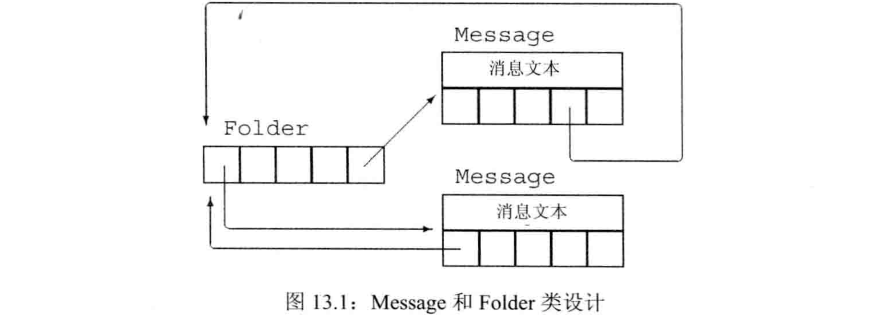

## 拷贝控制和资源管理

- 管理类外资源的类通常需要定义拷贝控制成员，因为它需要析构函数来释放资源，几乎肯定也需要拷贝构造函数和拷贝赋值算符
- `拷贝语义`：有2种选择，可定义拷贝操作使类的行为看起来像值或指针
  - `行为像值的类`：每个对象有自己的资源。拷贝一个像值的对象时，副本和原对象完全独立。改变副本不会改变原对象，反之亦然。
  - `行为像指针的类`：所有对象共享资源。拷贝一个像指针的对象时，副本和原对象使用相同的底层数据。改变副本会改变原对象，反之亦然。
- 标准库容器和string的行为像值，shared_ptr的行为像指针；IO类型和unique_ptr不允许拷贝/赋值故**既不像值也不像指针**


### 行为像值的类

- 为了提供**类值**的行为，对于类管理的资源，每个对象都应有一份**拷贝**。
- `赋值算符通常组合了析构函数和构造函数的操作`（销毁左侧对象的资源类似析构，从右侧对象拷贝/移动类似拷贝构造），且应保证执行顺序正确，可处理**自赋值**。如果可能，还要**保证异常安全**（当异常发生时能将左侧运算对象置于一个有意义的状态）
  - `自赋值安全`：先拷贝右侧对象资源，再销毁左侧对象资源
  - `异常安全`：先分配空间存放临时资源，再改变左侧对象状态
- 最佳实践：定义赋值算符的步骤：
  1. 将右侧对象的资源拷贝出来
  2. 释放左侧对象的资源
  3. 让左侧对象接管从右侧对象拷出的资源
- 例子：类值版本的HasPtr

```cpp
class HasPtr{
public:
    //构造时分配动态内存
    HasPtr(const string &s=string()):
          ps(new string(s)),i(0)
          {}
    //拷贝构造时也分配动态内存并拷贝数据，保证各对象资源独立
    HasPtr(const HasPtr &p):
          ps(new string(*p.ps)),i(p.i)
          {}
    HasPtr &operator=(const HasPtr &);
    ~HasPtr(){delete ps;}
private:
    string *ps;
    int i;
};
//定义拷贝赋值算符，保证自赋值安全、异常安全
HasPtr &HasPtr::operator=(const HasPtr &rhs){
    auto newp=new string(*rhs.ps);  //1、将右侧对象的资源拷出
    delete ps;                      //2、释放左侧对象的资源
    ps=newp;                        //3、让左侧对象接管拷出的资源
    i=rhs.i;
    return *this;
}
```


#### 关键概念：赋值运算符

当编写赋值运算符时，有两点需要记住：

- 如果将一个对象赋予它自身，赋值运算符必须能正确工作。(**自赋值的处理**)

- 大多数赋值运算符组合了析构函数和拷贝构造函数的工作。

  当编写一个赋值运算符时，一个好的模式是先将右侧运算对象拷贝到一个局部临时对象中。当拷贝完成后，销毁左侧运算对象的现有成员就是安全的了。一旦左侧运算对象的资源被销毁，就只剩下将数据从临时对象拷贝到左侧运算对象的成员中了。


### 定义行为像指针的类（`暂时未看`）

- 对于行为像指针的类，需为其定义拷贝构造函数和拷贝赋值算符，来**拷贝指针成员本身**而不是它管理的底层资源
- 令一个类行为像指针的最好办法是用`shared_ptr`来管理类内的资源
- 当希望直接管理资源时，使用`引用计数`的工作方式：
  - 除了初始化对象外，每个`构造函数`（除拷贝构造函数外）都会创建**独立的**计数器（经常放在动态内存中），记录有多少对象与正在创建的对象共享数据。每个计数器初始化时都为1。
  - `拷贝构造函数`**不创建新的**计数器，而是拷贝数据成员（包括指向计数器的指针），并将共享的计数器递增，指出给定对象的状态又被一个新用户所共享！
  - `析构函数`递减计数器，指出共享状态的用户少了一个。若计数为0则销毁底层数据。
  - `拷贝赋值算符`递增右侧对象的计数器，递减左侧对象的计数器。若左侧对象计数为0则销毁其底层数据
- 计数器不能直接作为类的成员，需**动态开辟**内存空间。
- 计数器被保存在动态内存中，每次调用构造函数（**除**拷贝构造函数外）创建一个对象时都分配新的计数器。拷贝或赋值对象时，拷贝指向计数器的指针，使得副本和原对象共享相同的计数器。
- 赋值运算必须处理`自赋值`。实现方式是**先**递增右侧对象的计数**再**递减左侧对象的计数，顺序不能颠倒（否则无法处理自赋值）（检查是否为0之前递增）
- 例子：类指针版本的HasPtr，手动实现引用计数

```cpp
class HasPtr{
public:
    //构造函数
    HasPtr(const string &s=string()):
          ps(new string(s)),i(0),use(new size_t(1)) //动态内存中分配新的底层数据和计数器
          {}
    //拷贝构造函数
    HasPtr(const HasPtr &p):
          ps(p.ps),i(p.i),use(p.use)                //拷贝指针，共享底层数据和计数器
          {++*use;}                                 //递增引用计数
    //拷贝赋值算符
    HasPtr &operator=(const HasPtr &);
    //析构函数
    ~HasPtr();
private:
    //底层数据和引用计数需在多个智能指针间共享，故每个智能指针内部保存的是指向它们的指针
    string *ps;     //底层数据
    size_t *use;    //引用计数器
    int i;
};
//析构函数；析构函数不能无条件地delete ps，应该递减引用计数，再判断是否为0
HasPtr::~HasPtr(){
    if(--*use==0){  //递减计数器，若递减后为0则释放资源
        delete ps;
        delete use;
    }
}
//拷贝赋值算符，保证处理自赋值
HasPtr &HasPtr::operator=(const HasPtr &rhs){
    ++*rhs.use;     //1、递增右侧计数器
    if(--*use==0){  //2、递减左侧计数器，若递减后为0则释放资源
        delete ps;
        delete use;
    }
    ps=rhs.ps;      //3、将右侧指针拷贝到左侧，共享底层数据和计数器
    i=rhs.i;
    use=rhs.use;
    return *this;
}
```


## 交换操作

- 除定义拷贝控制成员外，管理资源的类通常还需定义`swap函数`（非成员）。对于与重排元素顺序的算法一起使用的类而言，swap函数很重要。这类算法需要在交换两元素时调用其类型的swap函数。**若未自定义swap，则算法调用标准库定义的swap**
- 交换两个对象，需要`一次拷贝和两次赋值`，**`即swap建立在拷贝控制之上`**
- `swap时尽量交换指针`，而不是分配新的副本
- 例子：交换对象时需要一次拷贝和两次赋值

```cpp
//以下是拷贝值实现swap，假设HasPtr是行为像值的类
HasPtr temp=v1;
v1=v2;
v2=temp;
//以下是拷贝指针实现swap，效率高很多
string *temp=v1.ps;
v1.ps=v2.ps;
v2.ps=temp;
```

### 自定义swap函数

- 在类中将swap声明为**友元函数**（访问类的私有成员），即可重载出该类型的swap
- 自定义swap**不是必须的**，但对于管理资源的类，自定义swap**可能是很重要**的优化手段
- swap经常被声明为`inline`以提高性能
- 例子：自定义swap友元函数

```cpp
class HasPtr{
    //声明为友元以访问private
    friend void swap(HasPtr &,HasPtr &);
    /* 其他成员定义，与“行为像值的类”相同 */
};
inline void swap(HasPtr &lhs,HasPtr &rhs){
    using std::swap;        //允许但不是必须使用std::swap
    swap(lhs.ps,rhs.ps);    //交换底层数据的指针，优先使用匹配的swap
    swap(lhs.i,rhs.i);      //交换内置类型的成员，优先使用匹配的swap
}
```

- 不同版本的swap：
  - 对于内置类型，没有特定版本的swap，使用std::swap即可
  - 对于类类型，应使用重载的swap，即使用swap而不是std::swap
- 每个调用都应该是swap，而不是std::swap。如果存在类型特定的swap版本，其匹配程度会**优于**std中定义的swap版本。（**原因p616页解释**）

- 最佳实践：`using std::swap;`允许使用标准库的swap，使用时用`swap`尽量选择最匹配的自定义swap

### 在赋值运算符中使用swap

- 定义了swap的类可用`swap实现赋值算符`，使用`拷贝并交换`技术，传参时拷贝右侧对象，将左侧对象与右侧对象的形参**副本交换**。
- 例子：用swap实现拷贝赋值算符

```cpp
//右侧对象按值传递，传进来时已经拷贝了一次，拷贝到形参rhs
HasPtr &HasPtr::operator=(HasPtr rhs){
    swap(*this,rhs);    //交换左侧对象与形参rhs
    return *this;       //此时this指针指向右侧对象拷贝出的对象，形参rhs是交换前的左侧对象
}                       //离开作用域，rhs（交换前的左侧对象）被销毁
```

- “拷贝并交换”技术是`自赋值安全`且是`异常安全`的：
  - 改变左侧对象之前就拷贝右侧对象，保证自赋值安全
  - 唯一可能抛出异常的是拷贝右侧对象时的new表达式（传参时），但这发生在改变左侧对象之前


## 拷贝控制示例(`暂时未看`)

- 例子：使用拷贝控制进行簿记操作。每个Message可出现在多个Folder中，每个Folder也可容纳多个Message，但每个Message的内容只有一个副本。如图13.1




- 具体实现：
  - 每个Message保存一条内容和一个它所在的Folder指针的`set`，每个Folder保存一个它容纳的Message指针的`set`
  - Message类提供`save`和`remove`操作，用于给定Folder添加/删除这个Message
  - Folder类提供`addMsg`和`remMsg`操作，用于在该Folder中添加/删除一个Message
  - `拷贝`Message时，除拷贝消息内容和Folder指针集合外，还要在容纳它的所有Folder中添加指向新Message的指针
  - `析构`Message时，除析构Message对象外，还要在容纳它的所有Folder中删除指向它的指针
  - 将一个Message`赋值`给另一个Message时，除更新左侧对象的内容外，还要从容纳左侧对象的Folder中删除左侧对象，并在容纳右侧对象的Folder中添加左侧对象
- 拷贝赋值算符通常执行拷贝构造函数和析构函数的工作，此时可定义公共的操作放在private中
- 代码：

```cpp
class Message{
    friend class Folder;                    //允许Folder访问
public:
    explicit Message(const string &str=""): //默认初始化为空字符串
                    contents(str)           //显式初始化内容，而Folder指针的集合隐式地默认初始化
                    {}
    Message(const Message &);               //拷贝构造函数
    Message &operator=(const Message &);    //拷贝赋值算符
    ~Message();                             //析构函数
    void save(Folder &);                    //给定Folder，双向添加
    void remove(Folder &);                  //给定Folder，双向删除
private:
    string contents;                        //Message存放的内容
    set<Folder *> folders;                  //用集合来存储Folder的指针，构造时默认初始化
    void add_to_Folders(const Message &);   //在给定Message所属的各Folder中添加本Message
    void remove_from_Folders();             //在本Message所属的各Folder中删除本Message
};
//给定Folder，双向添加
void Message::save(Folder &f){
    folders.insert(&f);
    f.addMsg(this);
}
//给定Folder，双向删除
void Message::remove(Folder &f){
    folders.erase(&f);
    f.remMsg(this);
}
//在给定Message所属的各Folder中添加本Message
void Message::add_to_Folders(const Message &m){
    for(auto f:m.folders)
        f->addMsg(this);
}
//在本Message所属的各Folder中删除本Message
void Message::remove_from_Folders(){
    for(auto f:folders)
        f->remMsg(this);
}
//拷贝构造函数
//1、拷贝数据成员
//2、在右侧对象所属的各Folder中添加左侧对象
Message::Message(const Message &m):
                contents(m.contents),folders(m.folders)
{
    add_to_Folders(m);
}
//析构函数
//1、在本对象所属的各Folder中删除该对象
//2、释放该对象的资源
Message::~Message(){
    remove_from_Folders();
}
//拷贝赋值算符
//1、在左侧对象所属的各Folder中删除左侧对象
//2、将右侧对象的数据成员拷贝到左侧对象
//3、在右侧对象所属的各Folder中添加左侧对象
//先删除后添加是为了处理自赋值。若先添加后删除，自赋值时最后删除会全部删掉
Message &Message::operator=(const Message &rhs){
    remove_from_Folders();
    contents=rhs.contents;
    folders=rhs.folders;
    add_to_Folders(rhs);
    return *this;
}
//swap操作
//1、两对象所属的各Folder中分别删除两对象
//2、交换数据成员
//3、两对象所属的各Folder中分别添加两对象（添加的是交换前的对方）
void swap(Message &lhs,Message &rhs){
    using std::swap;
    for(auto f:lhs.folders)
        f->remMsg(&lhs);
    for(auto f:rhs.folders)
        f->remMsg(&rhs);
    swap(lhs.folders,rhs.folders);      //调用set的swap
    swap(lhs.contents,ths.contents);    //调用string的swap
    for(auto f:lhs.folders)
        f->addMsg(&lhs);
    for(auto f:rhs.folders)
        f->addMsg(&rhs);
}
```


## 动态内存管理类

- 某些类在运行时需分配可变大小的内存空间，一般可使用标准库容器来保存可变数据，也可**自定义**拷贝控制成员来管理动态内存
- vector的每个添加元素的成员函数都会检查空间是否足够。若足够则在下一个位置构造元素，若不够则重新分配空间，将已有元素移动到新空间中并释放旧空间，再添加元素
- 例子：使用拷贝控制实现vector的内存分配
  - alloc静态成员是allocator对象，用于获得原始内存并用construct/destroy创建和删除元素
  - 3个指针成员界定内存的3个边界，如图13.2
  - 函数alloc_n_copy分配内存并拷贝给定范围的元素
  - 函数free销毁元素并释放内存
  - 函数reallocate在内存用完时重新分配
  - 函数chk_n_alloc保证至少有空间容纳一个新元素，如果没有就调用reallocate分配更多空间


- 代码：

```cpp
class StrVec{
public:
    //构造函数初始化3个指针为nullptr
    StrVec():
          elements(nullptr),first_free(nullptr),cap(nullptr)
          {}
    //拷贝构造函数
    StrVec(const StrVec &);
    //拷贝赋值算符
    StrVec &operator=(const StrVec &);
    //析构函数
    ~StrVec();
    //以下是实现vector部分功能的函数
    void push_back(const string &);
    size_t size() const {return first_free-elements;}
    size_t capacity() const {return cap-elements;}
    string *begin() const {return elements;}
    string *end() const {return first_free;}
private:
    //为类分配空间并构造元素
    static allocator<string> alloc;
    //检查空余部分，若大小为0则reallocate重新分配空间
    void chk_n_alloc();
    //拷贝一个迭代器范围，返回元素部分的起始指针和尾后指针
    pair<string *,string *> alloc_n_copy(const sting *,const string *);
    //若首指针非空则逆序销毁其管理的所有元素并释放动态内存
    void free();
    //重新分配空间
    void reallocate();
    string *elements;   //元素部分的起始指针
    string *first_free; //元素部分的尾后指针/空余部分的起始指针
    string *cap;        //空余部分的尾后指针
};
//检查空间是否够用，并在元素部分的尾部构造新元素
void StrVec::push_back(const string &s){
    chk_n_alloc();
    alloc.construct(first_free++,s);
}
//检查空余部分，若大小为0则reallocate重新分配空间
inline void StrVec::chk_n_alloc(){
    if(size()==capacity())
        reallocate();
}
//拷贝一个迭代器范围，返回元素部分的起始指针和尾后指针
pair<string *,string *> StrVec::alloc_n_copy(const sting *b,const string *e){
    auto data=alloc.allocate(e-b);              //分配空间用于拷贝元素
    return {data,uninitialized_copy(b,e,data)}; //使用uninitialized_copy完成拷贝，并返回两个指针
}
//若首指针非空则逆序销毁其管理的所有元素并释放动态内存
void StrVec::free(){
    if(elements){
        for(auto p=first_free;p!=elements;)
            alloc.destroy(--p);                     //按逆序逐个销毁
        alloc.deallocate(elements,cap-elements);    //释放空间
    }
}
//拷贝构造函数
//1、将右侧对象的元素部分拷贝，得到首指针和尾后指针
//2、让成员指针接管右侧对象拷出的动态元素
StrVec::StrVec(cosnt StrVec &s){
    auto newdata=alloc_n_copy(s.begin(),s.end());
    elements=newdata.first;
    first_free=cap=newdata.second;
}
//析构函数
//1、函数体调用free销毁该对象管理的动态元素，释放空间
//2、隐式析构部分销毁该对象的成员
StrVec::~SreVec(){free();}
//拷贝赋值算符
//1、将右侧对象的元素部分拷贝，得到首指针和尾后指针
//2、销毁左侧对象管理的动态元素
//3、让左侧对象的指针接管右侧对象拷出的动态元素
StrVec &StrVec::operator=(const StrVec &rhs){
    auto data=alloc_n_copy(rhs.begin(),rhs.end());
    free();
    elements=data.first;
    first_free=cap=data.second;
    return *this;
}
//1、分配原来2倍的空间
//2、把原来的元素依次移动到新空间
//3、释放原来的空间
//4、让类的指针接管新的空间
void StrVec::reallocate(){
    auto newcapacity=size()?2*size():1;             //原来空间的2倍或初始值1
    auto newdata=alloc.allocate(newcapacity);       //分配新空间
    auto dest=newdata;
    auto elem=elements;
    for(size_t i=0;i!=size();++i)
        alloc.construct(dest++,std::move(*elem++)); //第二个参数确定使用哪个构造函数的参数，move的返回结果会使得使用右值调用移动构造函数
    free();                                         //释放原来的空间
    elements=newdata;
    first_free=dest;
    cap=elements+newcapacity;
}
```

- 重新分配内存的过程中（如重新分配vector的空间时），使用`移动`而不是拷贝元素。因为拷贝这些元素的这个操作是多余的。使用移动能够避免分配和释放的额外开销，性能会好很多
- 若类定义了`移动构造函数`，则可将资源从给定对象移动（而不是拷贝）到正在创建的对象，并保证`移后源对象`处于有效的、析构安全的状态。
- `std::move`函数定义于`utility`头文件，在移动构造时对输入对象调用std::move表示希望使用移动构造函数（p470解释），否则使用拷贝构造函数。
- 通常不对std::move使用using声明，直接用std::move限定调用标准库中的版本。


## 对象移动

- 允许移动而非拷贝对象，是C++11最主要的特性之一。
  - 某些时候，对象`拷贝后立即销毁`不再使用（例如vector重新分配空间），此时用移动代替拷贝会大幅提高性能
  - 某些类包含**`不可被共享的资源`**（例如IO类、unique_ptr不可被拷贝），这些类的对象不可拷贝但可移动
- 旧标准中，没有直接的方法移动对象。因此，即使不必拷贝对象的情况下，我们也不得不拷贝。
- 旧标准的标准库容器只能存放可拷贝的元素，C++11后**只需可移动**即可放入容器


### 移动迭代器

- 用allocator移动初始化动态内存时，一般用construct结合循环逐个元素移动构造。若能用`uninitialized_copy`一次移动一个迭代器范围将更简单。
- `迭代器适配器`通过修改给定迭代器的解引用`*`算符来改变迭代器的行为。
- C++11定义了`移动迭代器适配器`。普通迭代器的解引用得到左值引用，移动迭代器的解引用得到右值引用。
- `make_move_iterator`函数将一个普通迭代器转换为移动迭代器，它接受一个普通迭代器作为参数，返回对应的移动迭代器。原迭代器的所有操作在移动迭代器中都照常工作。
- 可将移动迭代器传递给算法，特别是，可用uninitialized_copy一次移动初始化多个元素
- 例子：重写13.5的reallocate函数

```cpp
//1、分配原来2倍的空间
//2、把原来的元素依次移动到新空间
//3、释放原来的空间
//4、让类的指针接管新的空间
void StrVec::reallocate(){
    //原来空间的2倍或初始值1
    auto newcapacity=size()?2*size():1;
    //分配空间
    auto first=alloc.allocate(newcapacity);
    //使用移动迭代器范围，批量移动元素
    auto last=uninitialized_copy(make_move_iterator(begin()),
                                 make_move_iterator(end())，
                                first);
    free();
    elements=first;
    first_free=last;
    cap=elements+newcapacity;
}
```

- uninitialized_copy对输入序列的每个元素调用construct来构造，该函数用迭代器的解引用算符从输入序列中取元素。传递移动迭代器时construct使用右值引用来调用移动构造函数来构造元素
- 标准库不保证哪些算法可使用移动迭代器，哪些不适用。由于移动一个对象可能销毁原对象，故只有确信算法为元素赋值或将其传递给用户定义的函数后不再访问它时，才能向其传递移动迭代器
- 调用std::move时必须绝对确认移后源对象没有其他用户。在移动构造函数和移动赋值运算符这些类实现代码之外的地方，只有确信需要移动且移动是安全的时候，才可调用std::move


### 右值引用和成员函数

- 除拷贝控制成员外，普通成员同时提供拷贝和移动版本也可得到优化。方法是提供两个版本的重载：拷贝版本接受指向`const的左值引用`，移动版本接受指向`非const的右值引用`
- 例子：定义了push_back的容器有拷贝和移动两个版本

```cpp
void push_back(cons T&);    //拷贝版本，绑定到任意能转换为T的对象（临时量）
void push_back(T &&);       //移动版本，只能绑定到类型T的可修改的右值
```

- 定义拷贝和移动版本时，不需要为函数操作定义接受`const T &&`或是`T &`的版本。因为移动应改变对象，不能const；拷贝不应改变对象，应该const
- 例子：为13.5的StrVec定义拷贝和移动版本的push_back

```cpp
class StrVec{
public:
    void push_back(const string &); //拷贝版本
    void push_back(string &&);      //移动版本
    /* 其他成员 */
};
//拷贝版本
void StrVec::push_back(const string &s){
    chk_n_alloc();
    alloc.construct(first_free++,s);            //拷贝构造
}
//移动版本
void StrVec::push_back(string &&){
    chk_n_alloc();
    alloc.construct(first_free++,std::move(s)); //移动构造
}
//使用push_back，实参类型决定拷贝还是移动
StrVec vec;
string s="some string or another";
vec.push_back(s);       //传入左值，调用拷贝版本
vec.push_back("done");  //传入右值，调用移动版本
```


### 左值和右值引用成员函数

- 允许在右值对象上调用成员
- 允许向右值赋值（为维持后向兼容）
- 例子：在右值对象上调用成员，向右值赋值

```cpp
string s1="a value",s2="another";
auto n=(s1+s2).find('a');   //在右值对象上调用成员
s1+s2="wow!";               //向右值赋值
```

- C++11允许使用`引用限定符`来强制算符的左侧运算对象（即this对象）是左值或右值。
- 引用限定符置于参数列表后，可以是`&`/`&&`，分别指出this应指向左值/右值
- 引用限定符只能用于**非static成员函数**，且必须**同时**出现在声明和定义中
- 例子：引用限定符

```cpp
class Foo{
public:
    Foo &operator=(const Foo &) &; //有&无const，只能向可修改的左值赋值
    /* 其他成员 */
};
Foo &Foo::operator=(const Foo &rhs) &{
    /* 执行操作 */
    return *this;
}
//使用Foo
Foo &retFoo();  //返回引用，调用结果是左值
Foo retVal();   //返回值，调用结果是右值
Foo i,j;        //i和j都是左值
i=j;            //对，i是左值，该operator=可向左值赋值
retFoo()=j;     //对，retFoo()返回左值，该operator=可向左值赋值
retVal()=j;     //错，retVal()返回右值，该operator=不可向右值赋值
i=retVal();     //对
```

- 函数可同时使用const和引用限定符，此时限定符必须在const之后


## 重载和引用函数

- 可使用引用限定符来区分重载版本，且可综合const和引用限定符来区分重载版本
- 例子：用const和引用限定符来区分重载版本

```cpp
class Foo{
public:
    Foo sorted() &&;        //对右值对象调用，会改变调用对象
    Foo sorted() const &;   //对左值对象调用，不会改变调用对象
private:
    vector<int> data;
};
//原址排序
Foo Foo::sorted() &&{
    sort(data.begin(),data.end());          //直接在右值对象上排序
    return *this;                           //返回排序后的对象
}
//非原址排序
Foo Foo::sorted() const &{
    Foo ret(*this);                         //先拷贝一个副本
    sort(ret.data.begin(),ret.data.end());  //在拷贝的副本上排序
    return ret;                             //返回拷贝的副本
}
//使用sort
Foo &retFoo();      //返回引用，调用结果是左值
Foo retVal();       //返回值，调用结果是右值
retFoo().sorted();  //对左值调用，非原址排序
retVal().sorted();  //对右值调用，原址排序
```

- 用const重载（形参相同的）成员函数时，可定义有const和无const两个版本
- 用引用限定符重载（形参相同的）成员函数时，必须对所有版本都使用不同限定符（不能一个用而另一个不用）
- 即：如果一个成员函数有引用限定符，则具有相同参数列表的所有版本都必须有引用限定符
- 上述示例中，如果没有&&限定版本，则都会调用const &版本。


### 重载和引用函数示例

```cpp
#include<iostream>
#include<vector>
using namespace std;

class A {
public:
	A():a(1) {

	}
	A sort()& {
		cout << "&" << endl;
		return *this;
	}

	A sort()&& {
		cout << "&&" << endl;
		return *this;
	}

	A sort()const& {
		cout << "const &" << endl;
		return *this;
	}

	A sort()const &&{
		cout << "const &&" << endl;
		return *this;
	}
	const A operator+(const A& bb) const {
		A temp;
		temp.a = this->a + bb.a;
		return temp;
	}
private:
	int a;
};


int main() {
	A a;
	a.sort();
	cout << endl;

	A().sort();
	cout << endl;

	const A b;
	b.sort();
	cout << endl;

	(a + a).sort();
	cout << endl;
    
    std::move(b).sort();
    
	return 0;
}


//输出分别为：
&

&&

const &

const &&

const &&
```


