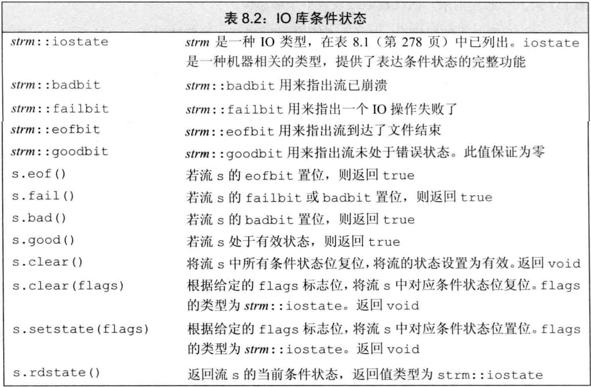
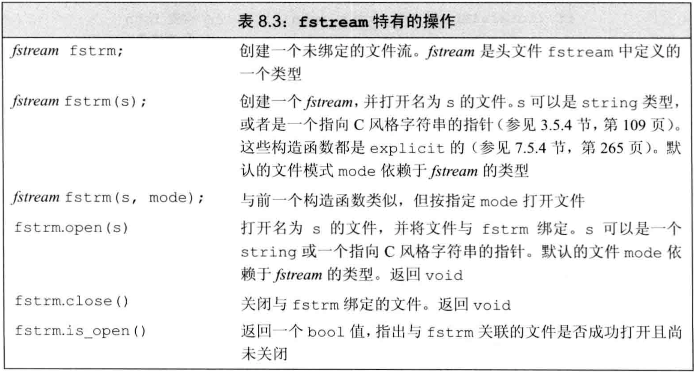
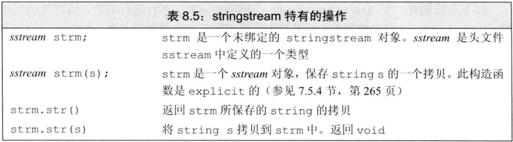

- C++语言不直接处理输入输出，而是通过标准库中的一组类来处理IO

- 这些IO类可从设备读写数据，设备可以是文件、控制台窗口等。还有一些类型允许内存IO，即读写字符串
- 1.2节介绍的IO库：
  - `istream`（输入流）类型，提供输入
  - `ostream`（输出流）类型，提供输出
  - `cin`，是istream对象，从标准输入读取数据
  - `cout`，是ostream对象，向标准输出写数据
  - `cerr`，是ostream对象，用于输出错误信息，写到标准错误
  - `>>`运算符，从istream对象读输入
  - `<<`运算符，向ostream对象写输出
  - `getline`函数，从给定的istream读取一行数据，存入string对象


## IO类

- 实际程序不仅要从`控制台窗口`进行IO操作，还需要读写`文件`，而且用IO操作处理`字符串`也很方便。另外，程序可能需要读写`宽字符`文本
- 标准库的IO类型在3个头文件中：
  - `iostream`头文件定义了读写流的基本类型
  - `fstream`头文件定义了读写命名文件的类型
  - `sstream`头文件定义了读写string对象的类型
- 表8.1是标准库中的这些IO类型和头文件


- 为支持宽字符语言，标准库定义的IO类也可操纵`wchar_t`类型数据，它对应的类型和函数名以`w`开始
- 设备类型和字符宽度不会影响IO操作，例如`>>`运算符对控制台窗口、文件、字符串都可用，对char和wchar_t也可用
- 通过`继承`，标准库可忽略这些不同设备和不同字符宽度的流的差异。利用`模板`，可以使用具有继承关系的类
- 声明一个类`继承`自另一个类，则通常可将`派生类`当作`基类`来使用
- 类型ifstream和istringstream都继承自istream，即可以像使用istream对象一样使用ifstream和istringstream对象
- 本节所述的流特性都可无差别地应用于普通流、文件流、字符串流，以及char和wchar_t版本


### IO对象无拷贝或赋值

- 不能拷贝IO对象，不能给IO对象赋值，所以不能将形参或返回类型设为流类型
- 进行IO操作的函数通常以`引用`方式传递和返回流
- 读写IO会改变其状态，故传递和返回的引用不能const


### 条件状态

- IO很可能发生错误。一些错误可恢复，另一些错误在系统深处，超过了程序可处理的范围
- 表8.2定义的函数和标志可帮助访问和操纵流的`条件状态`



- 流发生错误的例子：从外部读到的类型和程序中需要的类型不匹配时，流进入错误状态

- 一个流一旦发生错误，其上后续的IO操作都会失败。只有无错误才能继续读写

- 使用流时应检查状态，将其当作条件。如`while(cin>>word)`，其中`>>`返回流的状态，操作成功则流有效

- 当流作为条件时，只能知道是否有效，不知道具体发生了什么，有时我们需要知道流为什么失败

- 表8.2中，定义了一个机器无关的`iostate`类型，可表达流的状态，这个类型是`标志位`的集合

- 表8.2中，定义了4个iostate类型的constexpr值来表示特定的位模式。这些值用于表示特定的条件状态，可与位运算符一起使用来一次检测或设置多个标志位

  - `badbit`表示系统级错误，如不可恢复的读写错误。一旦它被置位，流就无法使用
  - `failbit`在发生可恢复错误时被置位，如读取类型错误
  - 读到EOF处，`eofbit`和`failbit`都被置位
  - `goodbit`的值为0表示无错误

- badbit、failbit、eofbit中的任一个被置位，则检测流状态的条件都会失败

- 表8.2中，定义了一组函数来查询这些iostate标志位的状态，

  - `good()`在所有错误位均未置位时返回true
  - `bad()`、`fail()`、`eof()`均在对应错误位被置位时返回true
  - `badbit`被置位时，`fail()`也会返回true

- 将流当作条件时，等价于判断`!fail()`，而`eof()`和`bad()`操作只能表示特定错误

- 表8.2中定义的`rdstate()`操作返回iostate类型值，表示流的当前状态

- 表8.2中定义的`setstate()`操作接受iostate类型值，将给定的条件位置位，表示发生了对应错误

- 表8.2中定义的clear成员函数有两个版本：

  - `clear()`清除（复位）所有错误标志位，执行clear()后，调用good会返回true
  - `clear(flags)`接受iostate类型值，表示流的新状态
  
- 例子：rdstate、setstate、clear

```cpp
auto old_state=cin.rdstate();                           //保存cin的状态
cin.clear();                                            //清除错误位，使之有效
process_input(cin);                                     //使用cin
cin.setstate(old_state);                                //将cin置为原来的状态
cin.clear(cin.rdstate() & ~cin.failbit & ~cin.badbit);  //复位failbit和badbit，其他位不变
```


### 管理输出缓冲

- 每个输出流都管理一个缓冲区，用于保存程序读写的数据

- 由于写设备很耗时，操作系统将程序的多个输出操作**组合成**单一的设备写操作，可大幅提高性能

- 导致缓冲刷新（即数据真正写到设备/文件）的原因：

  - 程序`正常结束`，缓冲刷新作为main的return的一部分
  - `缓冲区满`时刷新
  - 用操纵符如`endl`、`flush`、`ends`显式刷新
- 输出操作之后可用操纵符`unitbuf`设置流的内部状态，使其在每次输出都刷新缓冲。默认时cerr是unitbuf的，即写到cerr的内容是立即刷新的
  - 一个输出流可能被`关联`到另一个流。读写被关联的流时，关联到的流的缓冲被刷新。例如，cin和cerr关联到cout，故读cin或写cerr都将使cout的缓冲区被刷新

- 操纵符endl、flush、ends显式刷新:

  - `endl`输出换行并刷新
  - `flush`直接刷新，不输出字符
  - `ends`输出空字符并刷新

- `unitbuf`操作符告诉流，接下来的每次写操作之后都进行flush

- `nounitbuf`操作符重置流，使其恢复默认刷新

- 例子：endl、flush、ends、unitbuf、nounitbuf

```cpp
cout<<"hi!"<<endl;  //输出"hi!"和换行符，刷新缓冲
cout<<"hi!"<<flush; //输出"hi!"，刷新缓冲
cout<<"hi!"<<ends;  //输出"hi!"和空字符，刷新缓冲

cout<<unitbuf;      //之后的所有cout输出都将立即刷新缓冲
cout<<nounitbuf;    //恢复cout的默认刷新
```

- 若程序异常终止，输出缓冲不会被刷新。

  因此调试崩溃的程序时**要保证**输出数据确实被刷新（可能输出数据被挂起而没有打印而已）

- 当一个输入流被关联到一个输出流时，任何从该输入流读取的操作都刷新关联的输出流。

  标准库将cout和cin关联在一起

- 交互式系统通常应关联输入输出流，保证所有提示信息都在读操作前被打印tie

  函数有两个重载的版本

  - `tie()`返回指向输出流的指针，若未关联到流则返回空指针
  - `tie(ostream)`接受一个指向ostream的指针，将自己关联到此ostream。用法如`x.tie(&o)`将流`x`关联到输出流`o`

- 每个流最多同时关联一个流，但多个流可同时关联到同一个ostream

- 例子：流的关联

```cpp
cin.tie(&cout);                     //将cin关联到cout（实际上标准库已经将二者关联在一起）
ostream *old_tie=cin.tie(nullptr);  //使cin不再关联到任何流
cin.tie(&cerr);                     //将cin关联到cerr
cin.tie(&old_tie);                  //重建cin和cout间的正常关联
```


## 文件输入输出

- 头文件`fstream`

  定义了3个IO类来读写文件：
  
  - 类`ifstream`从给定文件读数据
- 类`ofstream`向给定文件写数据
  
- 类`fstream`可读写文件
  
- fstream中的这些类型继承自iostream的对应类型，它们提供的操作类似cin和cout，即`<<`、`>>`、`getline`等，以及8.1节中的所有操作

- 表8.3是fstream中比iostream新增的成员




### 使用文件流对象

- 要读写文件时应定义`文件流对象`，并将对象与文件关联
- 表8.3中定义的`open(s)`将对象与文件关联，定位给定文件并视情况打开为读/写模式
- 创建文件流对象时可在构造函数中提供文件名`filename`，此时`open(filename)`会被自动调用。在C++11之前，文件名只能是C风格字符串，C++11后文件名可是string对象或C风格字符串
- 在要求`基类`对象的地方，可用`派生类`对象代替。例如，接受iostream引用/指针的函数，可用对应的fstream/sstream引用/指针来调用
- 可以先定义空文件流对象（默认初始化），再调用`open`与文件关联
- 如果调用`open`失败，则`failbit`被置位
- 对已经关联到文件的流再次调用`open`会失败，并将`failbit`置位
- 如要将已经关联到文件的流关联到另一个文件，必须先用`close`关闭已关联的文件
- 例子：fstream的open和close

```cpp
ifstream in(ifile);         //初始化时关联到文件
ofstream out;               //默认初始化
out.open(ifile+".copy");    //打开文件
if (out){/*使用out*/}       //先检查是否成功关联到文件，再使用流
in.close();                 //一个文件流打开另一个文件前，必须关闭当前文件
in.open(ifile+"2");         //打开另一个文件
```

- 当fstream被正确析构时（例如离开作用域），`close`会被自动调用，关联文件自动关闭


### 文件模式

- 表8.4定义了每个文件流都有一个关联的`文件模式`，用来指出如何使用文件


- 用open打开文件或用文件名构造文件流对象时，都可指定文件模式
- 指定文件模式的限制：
  - 只可对ofstream或fstream对象设定`out`模式
  - 只可对ifstream或fstream对象设定`in`模式
  - 只有当out也被设定时才可设定`trunc`模式
  - 只要trunc未被设定，就可设定app模式。在`app`模式下，文件总以out模式被打开
  - 默认情况下，即使未指定trunc，以out模式打开的文件也会被截断，即默认用out即用了trunc。为`避免截断`，可指定app模式，使数据追加到文件末尾；或指定in模式，同时读写。
  - `ate`和`binary`模式可用于任何文件流对象，且可与其他任何模式组合
- 每个文件流类型都定义了默认的文件模式：
  - `ifstream`关联的文件默认以in模式打开
  - `ofstream`关联的文件默认以out模式打开
  - `fstream`关联的文件默认以in和out模式打开
- 默认方式（out模式）打开ostream时，文件会被丢弃。因为out模式意味着同时使用trunc模式。保留已有数据的方法是显式指定`app`或`in`模式
- 同一个流，每次用open关联到不同文件时，都可改变模式
- 例子：指定模式

```cpp
//以下3条等价，都会截断file1
ofstream out("file1");
ofstream out("file1", ofstream::out);
ofstream out("file1", ofstream::out|ofstream::trunc);
//以下2条等价，为保留文件内容，显式指定app模式
ofstream out("file2", ofstream::app);
ofstream out("file2", ofstream::out|ofstream::app);
```


##  string流

- 头文件`sstream`定义了3个类型来支持内存IO，它们可读写string：

  - `istringstream`从string读数据
  - `ostringstream`向string写数据
  - `stringstream`既可读string又可写string

- 头文件sstream中定义的类型都继承自iostream中对应的类型

- 表8.5是sstream中定义的类型的特有操作




### 使用istringstream

- 用`getline`逐行读取，每次读到的整行文本用`istringstream`读取单词


### 使用ostringstream

- 用`ostringstream`逐步构造输出，最后一起打印