- 一个`容器`是特定类型对象的集合	 
- `顺序容器`中元素的顺序与其加入容器的位置对应
- `关联容器`中元素的顺序由其关联的关键字决定，关联容器分为`有序关联容器`和`无序关联容器`
- **所有**容器类**`共享公有接口`**，**不同**容器按**不同**方式扩展。
- 标准库还提供了3种`容器适配器`，为容器操作定义了不同的接口
- 本章9.2节的接口对所有容器适用，之后的小节只适用于顺序容器


# 顺序容器概述

- 所有容器都可快速访问元素，但在不同方面有折中：
  - 添加/删除元素的代价
  - 非顺序访问的代价
- 如表9.1是顺序容器的类型

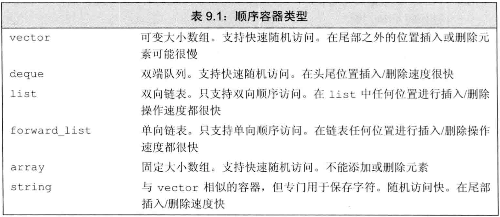

> 存储元素的策略影响容器的操作效率，甚至限制容器的某些操作

- 只有`array`**大小固定**，其他容器**都允许**扩张和收缩，且高效
- 除array外，其他容器对应2种内存模型：

  - `顺序表`：`string`和`vector`将元素存储在**连续空间**中，故通过下标的随机访问很快，在中间和头部插入/删除很慢，在尾部添加元素很快，添加元素可能造成空间的重新分配和元素拷贝。`deque`（双端队列）支持快速随机访问，且在中间插入/删除元素很慢，但两端插入/删除很快。
  - `链表`：`list`（双向链表）和`forward_list`（单向链表）的设计目的是让任何位置的插入/删除都快速高效且不需重新分配内存。**但不支持随机访问，**为访问一个元素需要遍历整个链表。由于要存储指针，故**内存开销大**。
- forward_list和array是**C++11**新增的类型：

  - array和内置数组一样大小固定，**但操作更安全**
  - forward_list的设计目标是达到与最快的手写单向链表相当的性能，故**没有size操作**（计算和保存都要开销）
- **最佳实践**：C++11的容器比旧版本快很多，其性能与优化过的手写数据结构一样好。**故应使用标准库容器而不是用数组造轮子**


# 选择容器的最佳实践：

- 一般用vector，除非有理由选其他容器
- 如果元素小而多，且空间开销重要，则不要用list或forward_list
- 若要求随机访问，则用vector或deque
- 若要在中间插入/删除，则用list或forward_list
- 若要在**头尾**插入/删除但不在中间插入/删除，则用deque
- 尽量避免在中间插入。例如可用vector存储，再用标准库算法做排序等操作来改变顺序
- 如**程序分为几阶段**，只有前半段必须在中间插入，则前半段用list，再拷贝到vector做后半段
- 若必须同时使用随机访问和中间插入，则看哪个占主导地位。可用实验来判断用list/forward_list还是vector/deque
- 若不确定用哪种容器，最好在程序中只用vector和list的**公共操作**：**使用迭代器而不是下标**，使用`++`/`--`而不是下标访问


# 容器库概览

- 本节是针对所有容器都适用的操作，本章剩下几节只对顺序容器适用，11章介绍关联容器
- 每个容器都定义于一个`头文件`中，**文件名与容器名相同**。
- 容器均定义为`模板类`
- 顺序容器**几乎可以保存任意类型的元素**，特别是，可以在容器中保存容器。**容器的容器**在**C++11之前**的版本中需要多写一个空格，如`vector<vector<string> >`
- **虽然我们可以在容器中保存几乎任何类型，但某些容器操作对元素类型有其自己的特殊要求。（如某些类没有构造函数，或构造函数私有）**
- 表9.2是**所有容器**都支持的通用操作

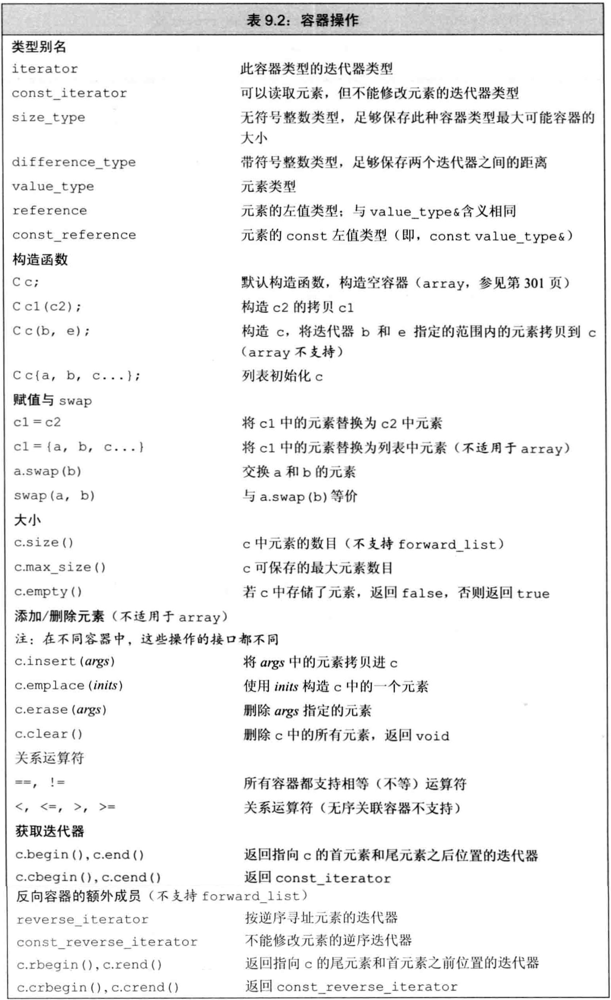


### 迭代器

- 表**3.6**列出了所有容器迭代器都支持的操作（例外：**forward_list不支持`--`**）

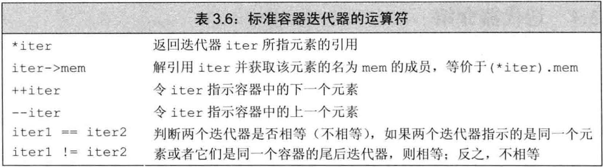

- 表**3.7**列出了`string`、`vector`、`deque`、`array`支持的迭代器算术运算。它们**不适用于其他容器**

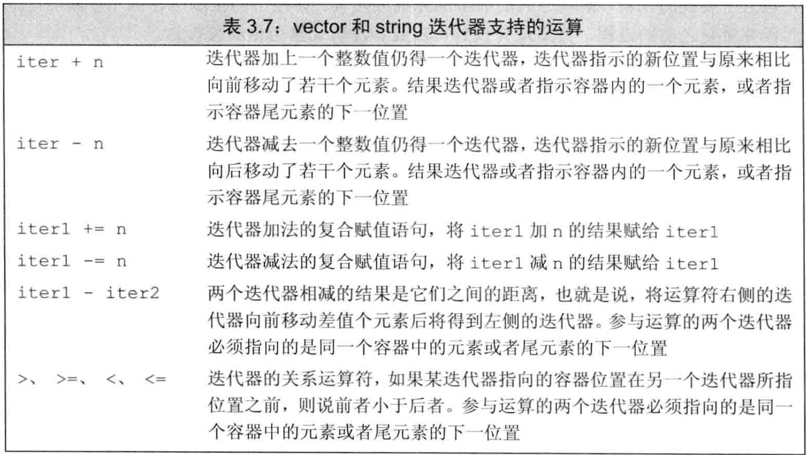

- 迭代器范围：由一对迭代器表示，两迭代器指向同一容器中的元素或尾后元素。迭代器范围包含它们之间（左闭右开）的所有元素。
- 左闭右开的**好处**:
  - 若begin与end相等则范围为空，不等则begin指向范围中的第一个元素
  - 可使begin递增直到begin==end。以此条件做循环，可保证迭代器有效

如果vec非空，则vec.end() - vec.begin() > 0， 也即vec.begin() < vec.end()


### 容器的`类型成员`

- 表9.2定义了容器通用的类型成员
- **要使用这些类型成员，需要用`::`指明作用域，即模板类的类名（含模板参数）**


### begin和end成员

- 不以c开头的（即非常量）迭代器都是**被重载过**的。

  - 实际上有两个名为begin的成员。一个是const成员，返回容器的const_iterator类型，另一个是非常量成员，返回容器的iterator类型。
  - `auto it=a.begin();`，仅当a是const的，it是const_iterator。
- 以c开头的（即常量）迭代器类型是**C++11定义的**，`用于支持auto与begin和end函数结合使用`。当需要返回const_iterator，则使用以c开头的函数。（为了简便）
- **不需要写访问时，尽量都用cbegin和cend**


### 容器定义和初始化

- 每个容器都定义了默认构造函数。`除array之外`的容器默认构造函数都会创建指定类型的**空容器**，且都可接受指定容器大小和初始值的参数
- 表9.3是容器的定义和初始化方法

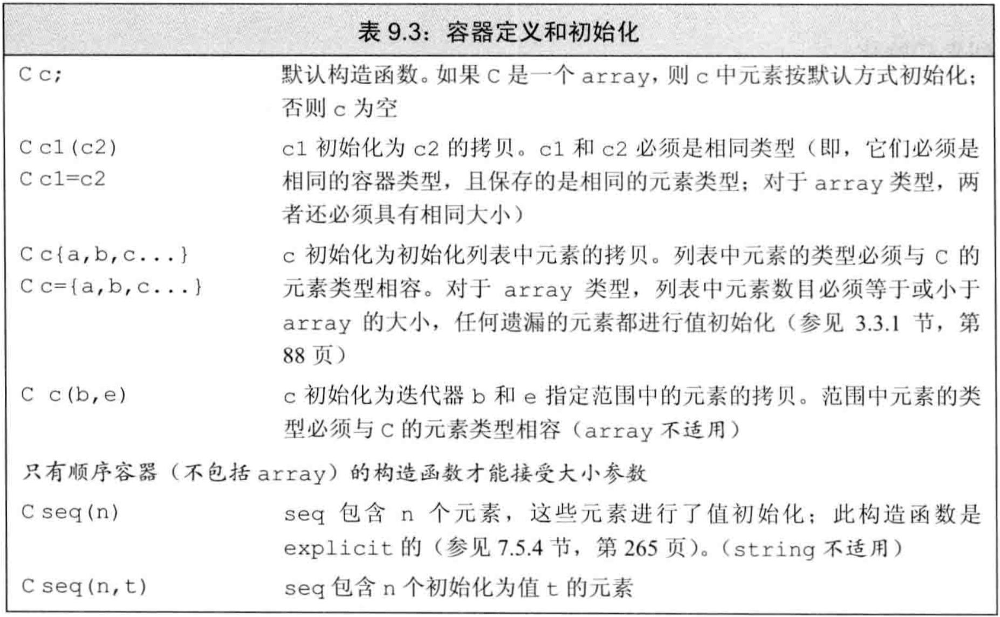

- 将一个新容器创建为另一个容器的拷贝，方法有2种：
  - 直接拷贝整个容器(`C c1(c2)`或 `C c1=c2`的方式)：两容器的类型和元素类型**都必须匹配	**
  
    ```cc
    vector<int> vec(5,10);
    vector<double> vec1(vec) //错误，元素类型必须相同
    ```
  
  - 拷贝**一对迭代器**指定的范围：
    - **不要求**容器类型相同，**也不要求**元素类型相同，**只要求**元素类型可转换。
    - **但不可用于array**。
    - 可拷贝元素的**子序列**，新容器大小与迭代器范围的大小相同。
  
- 例子：将一个新容器创建为另一个容器的拷贝

```cpp
list<string> authors={"Milton","Shakespeare","Austen"};
vector<const char *> articles={"a","an","the"};
list<string> list2(authors);                          //对，类型匹配
deque<string> authList(authors);                      //错，容器类型不匹配
vector<string> words(articles);                       //错，元素类型不匹配
forward_list<string> words(articles.begin(),articles.end());    //对，不需严格匹配
```

- 可对容器做**列表初始化**，显式指定初始值，如`vector<string> articles={"a","an","the"};`。
  - 除array外，初始化列表还**隐式指定**了容器的大小。
- 顺序容器（除array外）还可指定容器大小和给定初值，如`list<string> svec(10,"hi!");`。
  - 如果不给初值，则进行**值初始化**（内置类型初始化为0，类类型调用默认构造函数（**必须要有默认构造函数，否则不能省略初值**））。
  - 这种对关联容器不适用。

```cpp
vector<int> ivec(10,-1);		//10个int元素，每个都初始化为-1
list<string> svec(10,"hi");		//10个string；每个都初始化为"hi"
forward_list<int> ivec(10);		//10个元素，每个都初始化为0
deque<string> svec(10);			//10个元素，每个都是空string
array<int,10> arr;				//10个元素，初始值未定义
```


### array

- array的大小也是类型的一部分，定义时**必须同时**指定元素类型和大小
- array**不可**用普通的容器构造函数，因为它们都确定大小。
- 默认构造的array**非空**，它被填满元素，元素都被**默认初始化**。
- 可对array做列表初始化，列表长度须**小于等于**array大小，如果小于，则初始化靠前元素，剩下的被值初始化。
- 无论是指定构造函数还是列表初始化时，如果元素类型是一个类类型，那么该类**必须**有一个默认构造函数，以使值初始化能够进行。
- 与内置数组不同的是，array**`允许做整个容器的拷贝和赋值`**，要求两array大小和元素类型都一样才行。（使用迭代器拷贝部分元素的方式，array不支持）
- 例子：array的初始化和拷贝

```cpp
array<int,10> ia1;                          //默认初始化，局部变量默认初始化为任意数
array<int,10> ia2={0,1,2,3,4,5,6,7,8,9};    //列表初始化
array<int,10> ia3={42};                     //剩下元素被初始化为0
int digs[10]={0,1,2,3,4,5,6,7,8,9};
int cpy[10]=digs;                           //错，内置数组不可拷贝/赋值。digs被转为指针
array<int,10> digits={0,1,2,3,4,5,6,7,8,9};
array<int,10> copy=digits;                  //对，只要大小和元素类型相同即可
array<int, 10> copddy(digits.begin(), digits.end()); //错误
```


### 赋值和swap

- 表9.4的`赋值`相关操作可用于**所有容器**。赋值运算符将左边容器中的所有元素替换为右边容器中元素的`拷贝` 
- c1 = c2; //c1和c2具有**相同的容器类型，相同的元素类型**

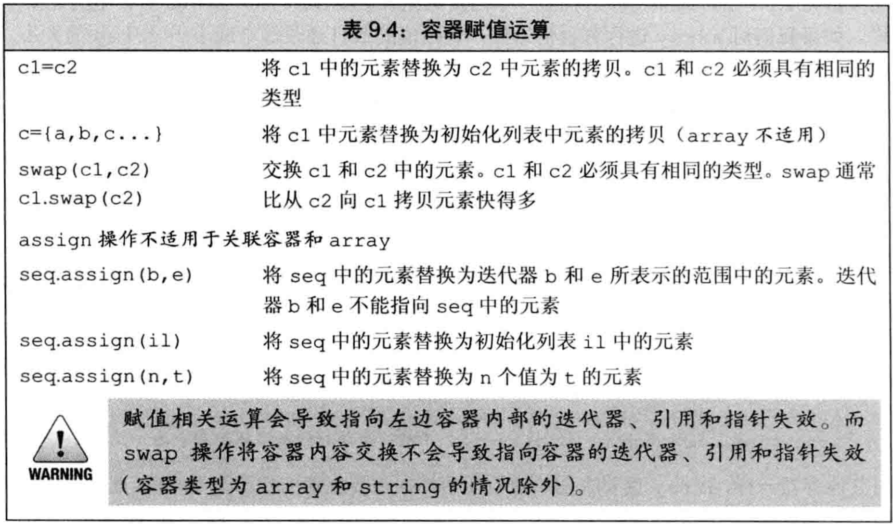

- 赋值前两容器大小**可不同**，赋值后大小都等于右边容器的大小


### assign

- 由于array大小固定，故只能用`=`赋值，**不可用**`assign`，**也不可用**花括号列表赋值。

- 赋值符`=`**要求**两侧**容器类型和元素类型都相等**(字符串字面值被认为是string，int可以转成double，double不能转成int)

  ```cc
  //指的是如下这种情况
  vector<double> vec = {1,2,3,4}; //正确
  vector<string> = {"hello", "world"};//正确
  
  vector<int> vec2 = {1.2, 1.3};//错误，从double到int进行收缩转换无效，可能会丢失数据
  
  //注意不是这个意思，下面的vec1的构造是错误的
  vector<int> vec(6,10); //正确
  vector<double> vec1(vec); //错误，容器类型，元素类型必须完全一致
  ```

  

- 但`assign`**不要求**`容器类型`相同，**只需要元素类型可转换即可**

- `assign`用参数指定的元素替换该容器的所有元素。其参数可为：
  
  - 一对迭代器范围
  - 一个initializer_list（或花括号列表）
  - 一个大小和初值的组合
  
- **由于旧元素被替换，故传递给assign的迭代器不能指向调用assign的容器**

- 例子：assign不要求容器类型和元素类型相同

```cpp
list<string> names;
vector<const char *> oldstyle;
names=oldstyle;                                     //错，容器类型和元素类型不匹配
names.assign(oldstyle.cbegin(),oldstyle.cend());    //对，只要元素类型可转换
```


### swap

- `swap`交换两个**相同类型**容器的内容（**`容器类型以及元素类型均需要相同`**）
- 除array外，swap操作都不交换元素本身，只交换数据结构。因此都是`O(1)`时间
- 对array做swap会真正交换元素，故是`O(n)`时间（主要：要求两个array类型相同（元素类型以及个数）
- **swap前后迭代器/指针/引用的变化：**
  - **除string和array外**，指向元素的迭代器/指针/引用，在swap后都指向原来的元素，**但**已经属于不同的容器了。例如：`it`指向`svec1[3]`，在进行`swap(svec1,svec2);`后，`it`指向`svec2[3]`，对`it`解引用得到的结果前后一致。
  - 对string使用swap导致之前的迭代器/指针/引用**都失效**
  - 对array使用swap导致之前的迭代器/指针/引用**指向的元素不变，但值发生改变**，即swap前后解引用得到的值不一致（因为真的交换了值）
- C++11同时提供swap的成员版本和非成员版本，但在旧标准中只有成员版本。在泛型编程中**`多用`** **非成员版本**，即用`swap(a,b)`而不是`a.swap(b)`


### 容器大小操作

- 3个关于大小的成员**函数**：
  - `size`返回容器中元素的数目(forward_list**不支持**)
  - `empty`当size为0时返回true，否则false
  - `max_size`返回一个大于等于该类型容器所能容纳的最大元素数量的值（很大的值） 


### 关系运算符

- **任何容器**都支持相等运算符`==`和`!=`，除无序关联容器外都支持关系运算符`<`、`<=`、`>`、`>=`
- 关系运算符两侧对象**`必须`** **容器类型相同且元素类型相同**，然后进行`字典顺序`的比较
- **只有**当元素定义了相应的比较符时，才可用其比较容器
- 容器的相等是用元素的`==`实现，其他关系运算符是用元素的`<`实现。如果元素类型不支持所需运算符，那么保存这种元素的容器**就不能**使用相应的关系运算


# 顺序容器操作

- 顺序容器和关联容器的不同之处在于它们组织元素的方式。`顺序容器`中元素的顺序与其加入容器的位置对应，`关联容器`中元素的顺序由其关联的关键字决定


### 向顺序容器添加元素

- 除array外，所有标准库容器都**可在运行时动态**`添加/删除`元素以改变容器大小
- 表9.5是向顺序容器添加元素的操作 

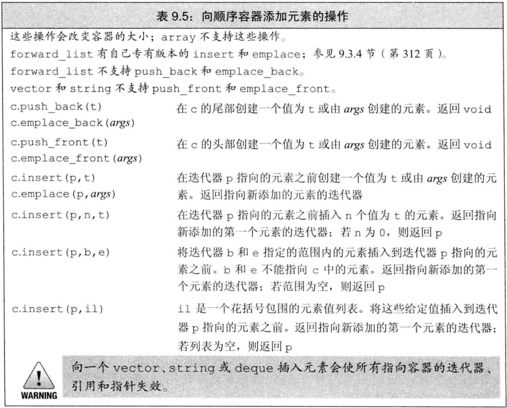


- `容器元素是拷贝`：用一个元素初始化容器，或把元素插入到容器中，都是**拷贝**。与原始对象互不影响。
- vector/string虽不可用push_front，但可用insert在头部插入
- insert接受迭代器作为第一个参数，指定插入的位置，在该`迭代器之前`插入。在之前是为了考虑**左闭右开区间**。（该指示迭代器可以是const的迭代器）
- insert后面的参数指定可插入的值，有4种：
  - 给一个`值`
  - 给`个数和值`，插入多个该值
  - 给一对`迭代器范围`，将此范围内的迭代器插入。此范围不可来自被插入容器
  - 给一个`initializer_list/花括号列表`
- C++11中，接受元素个数或迭代器范围的insert可返回指向`第一个新加入元素`的迭代器。如范围为空，则不插入，返回insert的第一个参数。该设计是**为了重复插入**
- 例子：利用insert返回值，反复插入元素

```cpp
list<string> lst;
auto iter=lst.begin();
while(cin>>word)
    iter=lst.insert(iter,word); //等价于反复调用push_front
```

### emplace

- 调用`emplace`时，它将参数传递给元素类型的构造函数，使用它们在容器的内存空间中直接构造元素。故`emplace的参数需对应到元素的构造函数参数`
- C++11引入新成员`emplace_front`、`emplace_back`、`emplace`，分别对应`push_front`、`push_back`、`insert`。区别是`emplace`是在原地构造元素，而push/insert是拷贝元素
- push/insert可能会创建局部的**临时量**，再将临时量拷贝到容器


### 访问元素

- 表9.6是顺序容器中访问元素的操作

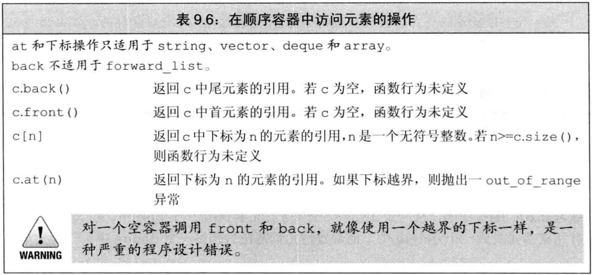

- 若访问处没有元素，则结果未定义

- 顺序容器都有`front`成员函数，除forward_list之外的顺序容器都有`back`成员函数。前者返回首元素的引用，后者返回尾元素的引用

- front/back与begin/end的**区别**：
  - front/back返回引用，begin/end返回迭代器
  - front/back返回首元素和尾元素，begin/end返回首元素和尾后元素
  - **空容器中**求front/back是未定义，但可求begin/end且有begin==end
  
- 表9.6中访问元素的成员函数（`front`、`back`、`[]`、`at`）都返回`引用`。

  **若要用auto**，记得将变量声明为**引用**，否则存在拷贝且不能修改容器。

- 提供快速随机访问的容器（string、vector、deque、array）都支持下标运算符`[]`。

- 下标运算`[]`**不检查**下标是否在合法范围，但`at`成员函数在下标越界时抛出`out_of_range`**异常**


### 删除元素

- 表9.7是顺序容器删除元素的操作，除array外

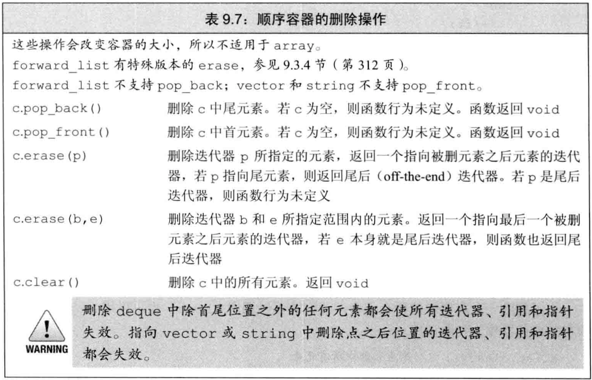

- 删除元素的成员函数**并不检查其参数**。在删除元素之前，程序必须确保它（们）是存在的。不能对空容器做删除操作
- `pop_front`和`pop_back`成员函数分别删除首元素和尾元素
- vector/string**不支持**push_front/pop_front，forward_list不支持push_back/pop_back
- pop_front/pop_back**返回void**，若需要值，需在pop之前保存
- erase可从指定的任意位置删除元素，它有两个版本：
  - 接受一个迭代器，删除它指向的元素，返回它**之后**位置的迭代器
  - 接受一个迭代器范围，删除左闭右开区间内的元素，返回删除列表最后元素**之后**位置的迭代器
- 要删除容器的所有元素，可用`clear`，也可用begin/end调用`erase`


### 特殊的forward_list操作

- 表9.8是forward_list的插入/删除操作 

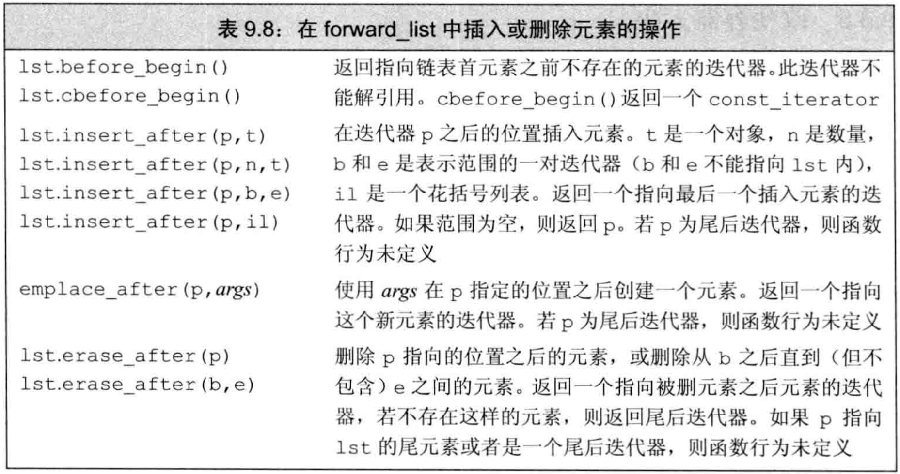

- 对forward_list（单向链表）的元素做插入/删除，需要知道其`前驱`。
- forward_list的插入/删除改变的不是指定元素，而是指定元素之后的一个元素
- forward_list未定义`insert`、`emplace`、`erase`，但定义了`insert_after`、`emplace_after`、`erase_after`来提供类似操作
- forward_list定义了`before_begin`迭代器，它指向首元素之前，称为`首前迭代器`
- 使用forward_list时需关注两个元素：我们要处理的元素，和它的前驱
- 例子：用两个迭代器操作forward_list

```cpp
forward_list<int> flst={0,1,2,3,4,5,6,7,8,9};
auto prev=flst.before_begin();          //要处理的元素的前驱
auto curr=flst.begin();                 //要处理的元素
while(curr!=flst.end()){
    if(*curr%2)
        curr=flst.erase_after(prev);    //删除curr，返回要处理的元素的下一个迭代器，作为下一轮循环要处理的元素
    else{
        prev=curr;                      //更新前驱
        ++curr;                         //更新要处理的元素的迭代器
    }
}
```


### 改变容器大小

- 如表9.9是用`resize`改变大小的操作，不支持array

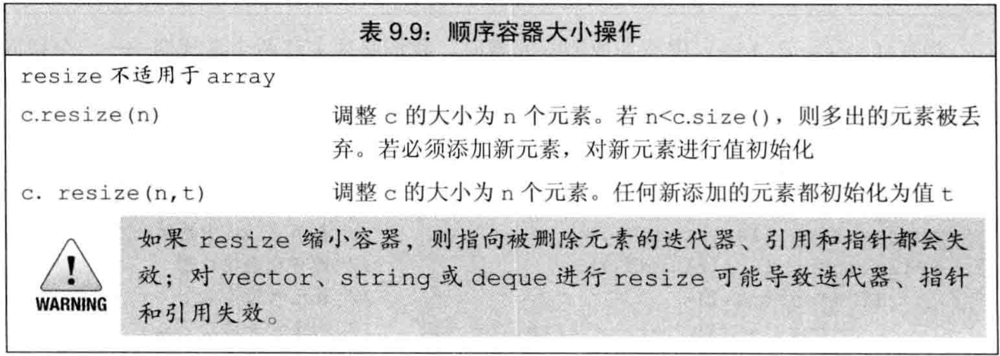

- 对于给定的目标大小，若比当前大小更小，则容器后面的元素都被删除，若比当前大小更大，则将`值初始化`的新元素添加到容器尾部。可以指定值初始化的初始值
- resize操作接受一个可选的元素值参数，用来初始化添加到容器中的元素。如果调用者未提供此参数，新元素进行值初始化。如果容器保存的是类类型元素，且resize向容器添加新元素，则我们必须提供初始值，或者元素类型必须提供一个默认构造函数。
- c.resize(n,t)如果n小于原c.size()，则参数t不起作用


# 容器操作可能使迭代器失效

- 向容器中添加/删除元素可能使指向元素的指针/引用/迭代器失效

- 添加元素后：
  - `vector/string`：若空间被重新分配，则所有指针/引用/迭代器失效。若空间**未**重新分配，则**插入位置的之后**的指针/引用/迭代器都失效
  - `deque`：插入首尾之外的任何位置都使所有指针/引用/迭代器失效。在首尾插入时，迭代器失效，指向元素的指针/引用不失效
  - `list/forward_list`：**所有**指针/引用/迭代器仍有效
  
- 删除元素后：
  - 指向被删除元素的指针/引用/迭代器**一定失效**
  - `vector/string`：删除位置的之后的指针/引用/迭代器都失效。特别是，删除任何元素时，尾后迭代器一定失效
  - `deque`：删除首尾之外的任何位置都使所有指针/引用/迭代器失效。删除首元素无影响，删除尾元素使尾后迭代器失效
  - `list/forward_list`：除被删除元素之外的所有指针/引用/迭代器仍**有效**
  
- 最佳实践：
  - 最小化要求迭代器有效的程序片段
  - 保证每次改变容器的操作后都**更新**迭代器
  - **不要保存**尾后迭代器，每次需要时都用end()**重新获取**
  
- 添加/删除vector/string/deque中的元素，**必须考虑指针/引用/迭代器的失效问题。**

  **用insert/erase可由返回值直接更新**

- 例子：用insert/erase实时更新迭代器

```cpp
vector<int> vi={0,1,2,3,4,5,6,7,8,9};
auto iter=vi.begin();
while(iter!=vi.end()){
    if(*iter%2){
        iter=vi.insert(iter,*iter); //复制奇数元素，迭代器实时更新，插入位置是iter之前，所以iter会失效
        iter+=2; //不要这么写代码，有危险
    }
    else
        iter=vi.erase(iter);        //删除偶数元素，迭代器实时更新,因为iter会失效
}
```

- 添加/删除vector/string的元素，deque除首尾处任何位置的插入/删除，都会使**尾后**迭代器失效。

  因此在每次插入/删除后必须**重新调用end**


## vector对象是如何增长的

- 为支持快速随机访问，vector将元素`连续存储`
- 若不使用适当的空间分配策略，则每次插入/删除操作都需要：`分配空间`、`拷贝元素`、`释放空间`
- 为减少分配/释放空间的次数，vector/string要求在每次需要分配新内存空间时，会分配比所需空间更大的空间，预留作备用。这样，就不需要每次天添加新元素都重新分配容器的内存空间了。
- 表9.10提供了vector内存大小管理的操作 

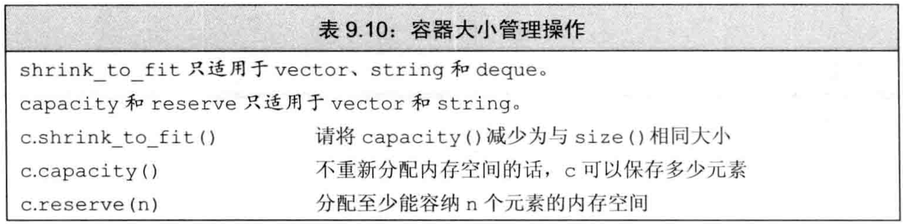

- `capacity`和`size`
  - capacity表示在不分配新的内存空间的前提下它最多可以保存多少元素。capacity操作告诉我们容器在不扩张内存时最多还能容纳多少元素
  - size是指容器已经保存的元素数目
  - capacity至少与size一样大，具体多大取决于实现
- reserve，操作允许通知容器它至少需要容纳多少元素，不改变元素的数量，即不改变`size`，只影响预分配的内存
  - 传给reserve的值小于等于当前capacity时，reserve什么都不做。特别是，小于时**不会**退回空间
  - 传给reserve的值大于当前capacity时，reserve扩张容量，**至少分配**与要求容量一样大的空间，可能更大，取决于标准库实现方式。
  - 改变容器大小的`resize`方法只改变元素数量，不影响capacity（VS上，增大resize()的值，capacity也会增大）
- `shrink_to_fit`是C++11的方法，它可要求vector/string/deque退回多余的空间，但具体实现可忽略此要求。即，不保证能退回。
- 只要没有超出vector的capacity，vector就不会自动扩张（不会重新分配内存）
- vector采用的`内存扩张策略`一般是：在每次需要分配新空间时，将当前容量翻倍。但具体实现可使用不同策略
- 所有扩张策略都应遵循的原则：确保用`push_back`添加元素有高效率。即，在初始为空的vector上调用n次push_back，花费时间不应超过n的常数倍
- reserve()和resize()一般不影响capacity，但如果该数值是往大增长，超过了capacity的数值，就会重新分配空间，改变capacity的值。


# 额外的string操作


### 构造string的其他方法

- 表9.11是string特有的3个`构造函数` 

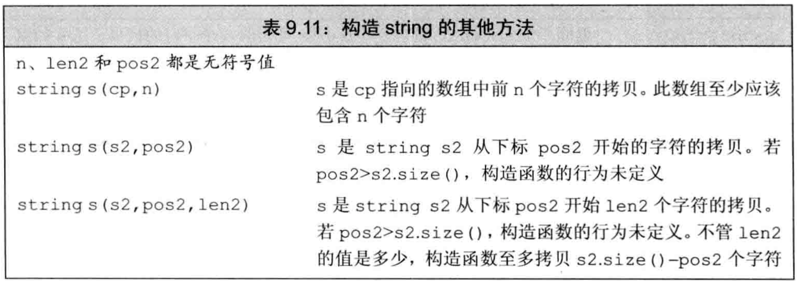

- 这些构造函数接受`string`或`const char *`参数作为源，还接受指定拷贝多少个字符的参数（此参数是可选的）。当源为string时，第二个参数为下标，用来指定从哪里开始拷贝
- 使用`const char *`构造string时，字符数组必须以空字符`\0`结尾，用于停止拷贝。但若给定拷贝大小的计数值，则只需不越界，此时不要求以空字符结尾。
- 使用`string`构造string时，可提供开始位置和计数值。开始位置必须小于等于源string大小，否则out_of_range异常。不管要求拷贝多少，最多拷到源string结尾。


### substring

- substring操作（表9.12）返回string，其值是原始string的一部分或全部的**拷贝**。可传递可选的起始位置和计数值。如果开始位置超过了string的大小，则substr抛出一个out_of_range异常。如果开始位置加上计数值大于string的大小，则substr**会调整**计数值，只拷贝到string的末尾。

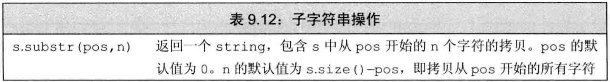


### 改变string的其他方法

- 表9.13定义了string特有的insert/erase/assign操作

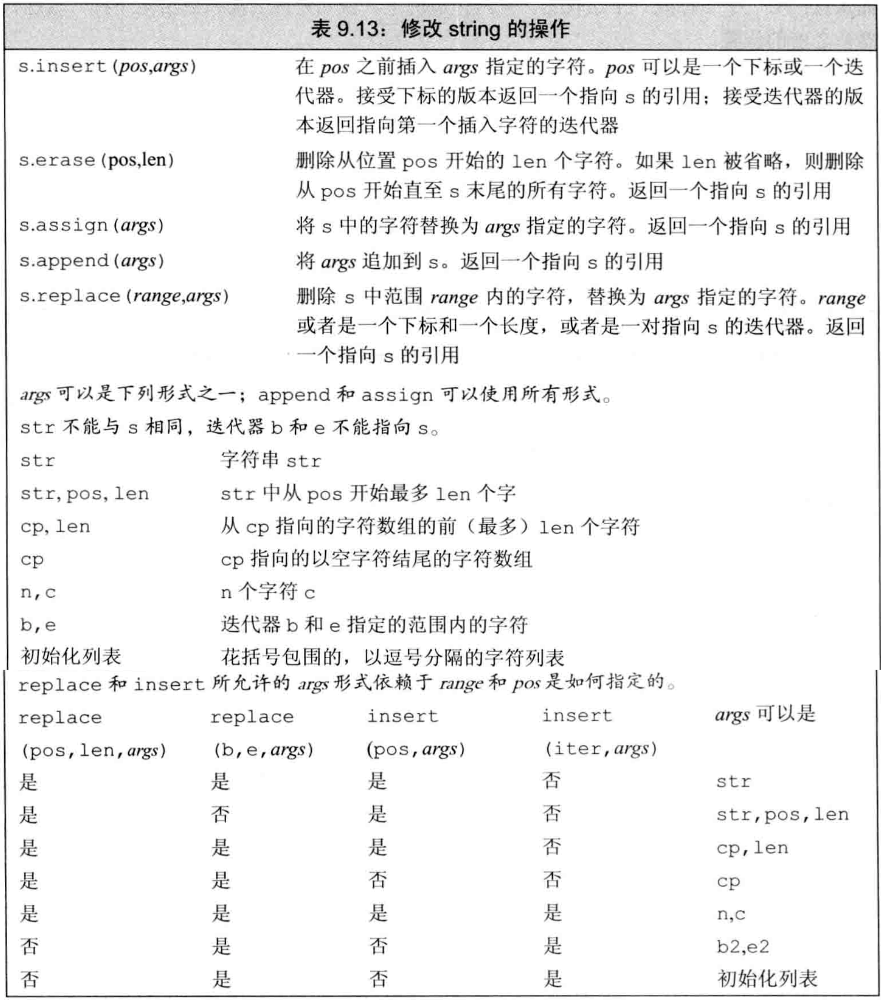

- string的`insert/erase`可接受下标，用于指定insert到指定值之前的位置，或是开始删除的位置。
- string的`insert/assign`可接受C风格字符串（以空字符结尾的C风格字符串，但操作结果不包括空字符）
- 可将来自其他string或子串的字符串插入到当前string或给其赋值。
- 例子：string的insert/erase/assign

```cpp
string s("hello world");
s.insert(s.size(),5,'!');   //s末尾插入5个'!'
s.erase(s.size()-5,5)       //删除最后5个字符
    
const char *cp="Stately, plump Buck";
s.assign(cp,7);             //s=="Stately"
s.insert(s.size(),cp+7);    //s=="Stately, plump Buck"，第二个参数指针指出从哪个地方开始

string s="some string", s2="some other string";
s.insert(0,s2);             //s位置0之前插入s2的拷贝
s.insert(0,s2,0,s2.size()); //s位置0之前插入s2位置0开始的s2.size()个字符
```

- append是在string末尾插入的简写
- replace是调用erase和insert的组合
- 例子：append和replace

```cpp
string s("C++ Primer"), s2=s;
s.insert(s.size()," 4th Ed.");  //s=="C++ Primer 4th Ed."
s2.append(" 4th Ed.");          //等价于上一行
s.erase(11,3);                  //s=="C++ Primer  Ed."
s.insert(11,"5th");             //s=="C++ Primer 5th Ed."
s2.replace(11,3,"5th");         //s2=="C++ Primer 5th Ed."，等价于上两行
s.replace(11,3,"Fifth");        //s=="C++ Primer Fifth Ed."
```

- append、assign、insert、replace都有多个重载版本，根据如何指定要添加的字符和string中被替换的部分
- 指定要被替换的部分：
  - assign/append无需指定替换哪部分：assign总是替换所有内容，append总将新字符追加到末尾
  - replace可用两种方式指定删除范围：可以用位置和长度，也可用迭代器范围
- insert可用两种方式指定插入点：下标或迭代器
- `指定要添加的字符`：见表9.13
- **改变string的多种重载函数**p324


### string搜索操作

- 如表9.14，string提供了6个搜索函数，每个函数有4个重载版本

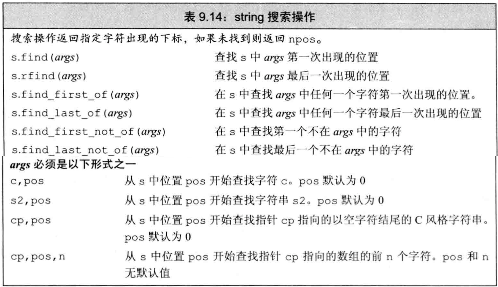

- 每个搜索操作都返回`string::size_type`类型值，表示匹配位置的下标。

- 若搜索失败，即无匹配，则返回名为`string::npos`的static成员，它是`string::size_type`类型且初始化为`-1`，即string最大的可能大小

- `string::size_type`是无符号类型，**不可与int等有符号混用**

- 搜索操作都是大小写敏感

- `find`查找参数字符串第一次出现的位置，`rfind`查找参数字符串最后一次出现的位置

- `find_first_of`查找参数中任何一个字符第一次出现的位置，`find_last_of`查找参数中任何一个字符最后一次出现的位置

- `find_first_not_of`查找第一个不在参数中的字符，`find_last_not_of`查找最后一个不在参数中的字符

  ```
  //调用者，参数；find_first_of。（具体执行过程可能不是描述的这样，但返回值是的：首先在参数找是否存在调用者的某个
  //或者某几个字符。然后看这几个匹配的字符中，第一个匹配字符在调用者中的下标，然后返回该下标。
  //find_last_of（。。。：首先在参数中找是否存在调用者的某个或某几个字符。然后看这几个匹配的字符中，最后一个匹配字符在调用者中的下标。
  //然后返回该下标。
  ```

- 可给find们指定第二个可选的开始位置，指出从哪里开始搜索。可利用此机制`循环查找`所有匹配的位置

- 例子：循环查找所有匹配

```cpp
string numbers("0123456789"), name("r2d2");
string::size_type pos=0;

while((pos=name.find_first_of(numbers,pos))!=string::npos){ //每次查找一个子串
    cout<<"found number at index: "
        <<pos
        <<" element is "
        <<name[pos]
        <<endl;
    ++pos;                                                  //移动到下一个字符，准备从后面的子串中查找。如果忽略了递增pos，循环就永远也不会停止
}
```


### compare函数

- `compare`函数类似C语言中的`strcmp`，根据源字符串等于、大于、小于给定的字符串，compare成员函数返回0、正数、负数
- 表9.15是compare函数接受的参数。根据我们是要比较两个string还是一个string与一个字符数组，参数各有不同。在这两种情况下，都可以比较整个或一部分字符串。

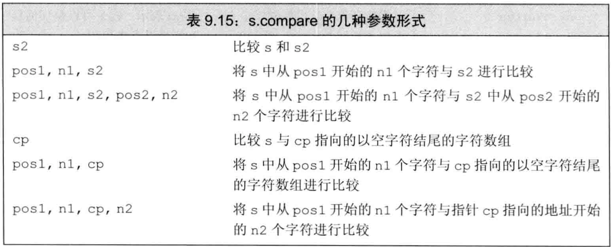


### 数值转换

- 表9.16规定了数值数据和string间的转换

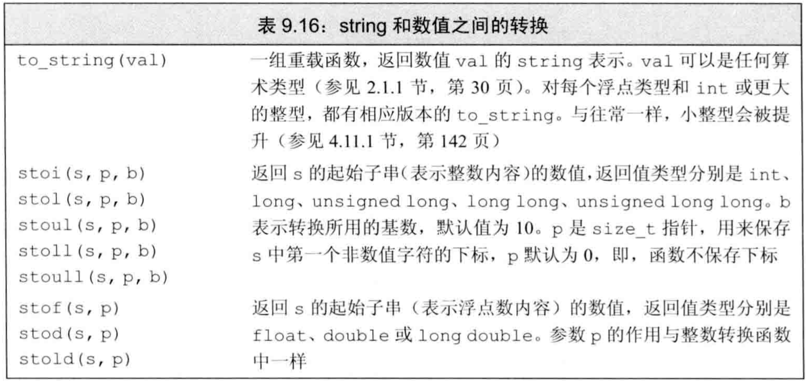

- `to_string`将数值类型转为对应的string表示，其他各函数将string表示转为相应的数值类型
- 要将string转为数值，必须保证string中的第一个非空白字符是该数值类型中可能出现的字符，例如正负号、数字等，也可是`0x`或`0X`表示的十六进制数（此时string中可包含字母）。对于浮点类型，可以小数点`.`开头，并可包含`e`或`E`指定指数部分。
- 如string不能转为指定的数值类型，这些函数抛出`invalid_argument`异常
- 如转换得到的数值无法用任何类型表示，则抛出`out_of_range`异常


# 容器适配器

- `适配器`是一种机制，能使某种事物的行为看起来像另一种事物。一个`容器适配器`接受一种已有的容器类型，使其看起来像另一种不同类型
- 定义了3个`顺序容器适配器`：stack、queue、priority_queue
- 表9.17定义了所有容器适配器都支持的操作和类型

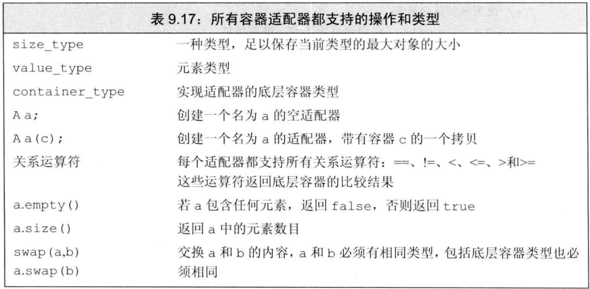

- 每个适配器都有两个构造函数：
  - 默认构造函数，创建空对象
  - 接受一个容器，拷贝该容器来初始化适配器
- 默认情况下，`stack`和`queue`基于deque实现，`priority_queue`基于vector实现。也可在创建时在模板参数里指定一个顺序容器来重载默认容器类型：`stack<string, vector<string> str_stk;`其中第二个参数为指定默认的容器类型。
- 对适配器的容器类型有**限制**：
  - 不能基于array，因为要添加/删除元素
  - 不能基于forward_list，因为要访问尾元素
  - `stack`要求`back`、`push_back`、`pop_back`操作，故可构建于除array/forward_list外的所有容器
  - `queue`要求`back`、`push_back`、`front`、`push_front`，故可构建于list/deque，但不能基于vector构造
  - `priority_queue`要求`front`、`push_back`、`pop_back`、`随机访问`，故可构建于vector/deque，但不能基于list构造
- stack定义于`stack头文件`中，其特有操作如表9.18 

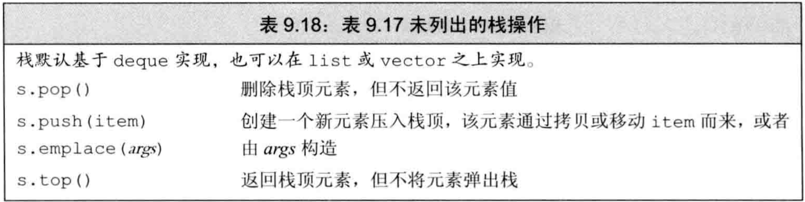

- 每个适配器都基于底层容器定义了自己的特殊操作，**只可用适配器操作**，不可用底层容器操作
- queue和priority_queue定义于`queue头文件`中，其特有操作如表9.19**(图中有误，pop删除队首元素，但不返回)**
- 标准库queue使用一种**先进先出**的存储和访问策略。（就是数据结构上的普通队列）

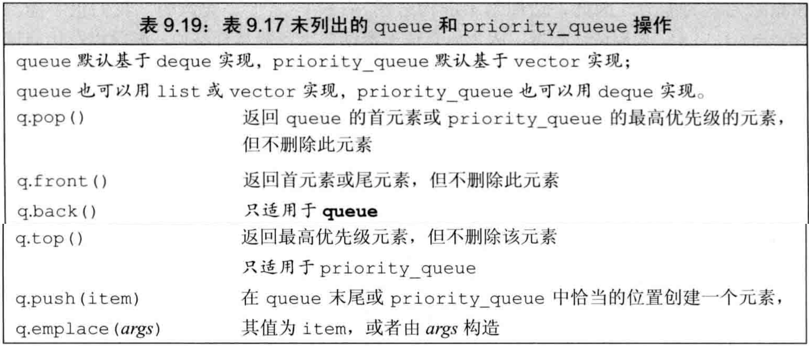

- priority_queue允许为队列中的元素建立优先级，新加入的元素会排在所有优先级比它低的已有元素之前。默认情况下使用元素类型的`<`运算符来确定优先级。将在p378也学习如何重载这个默认设置。